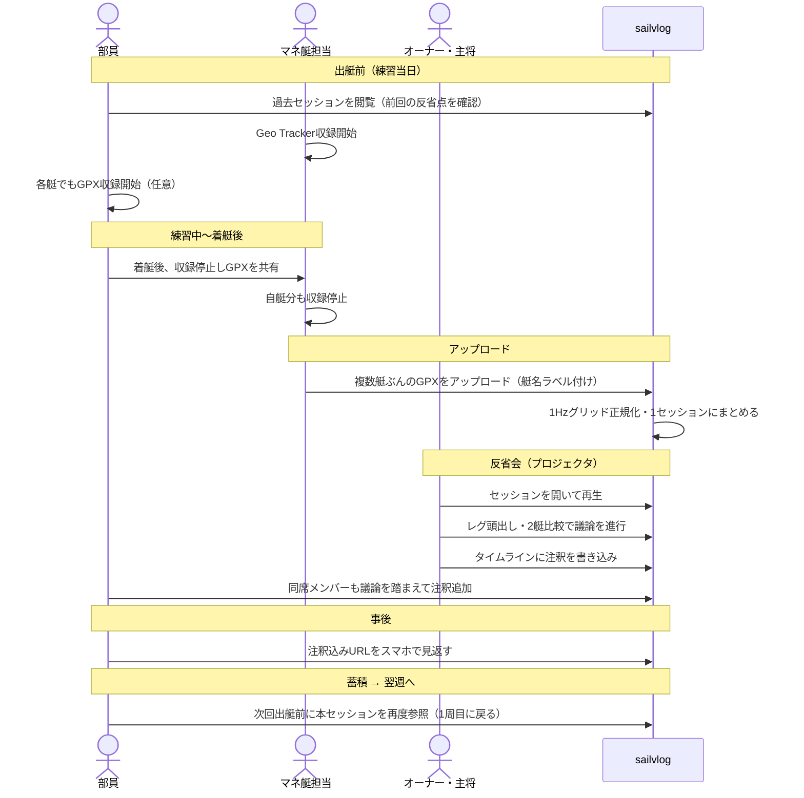
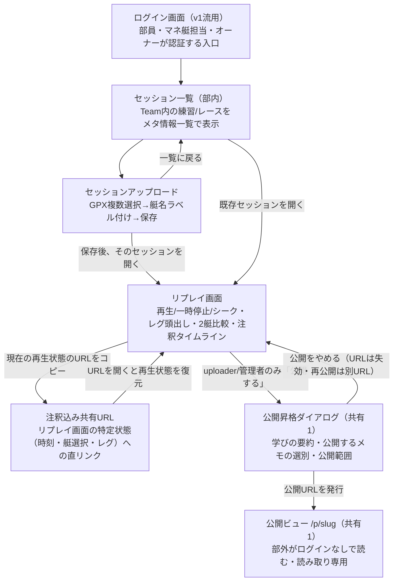

# FLOWS — sailvlog v3（反省会リプレイ・デバッガ 企画レビュー用）

<!-- 契約: 作成者 docs-writer / 入力: PRD.md rev.3 §3・§5、ARCH.md §2・§4、TASKS.md S1/S2 / 読者: オーナー（企画レビュー） -->
<!-- 位置づけ: 実装仕様書ではない。企画書（PRD）の理解を助ける2枚の図 -->

## 図1: イベントフロー図（1週間の運用サイクル）

E2（自前収録型リプレイ・デバッガ）主役の場合に、部の1週間でsailvlogがどう使われるかを時系列で示す。

**読み方**
- 「読む」（出艇前・反省会）と「書く」（着艇後・反省会）が分離しているのは、PRD §3の利用文脈をそのまま反映している。マネ艇担当は操作ほぼゼロが要件なので、練習中の関与は収録開始/停止のみ。
- アップロードを行うのはマネ艇担当1人（=供給の担い手が録る係に集約される、というPRD §4のE2推奨根拠）。部員各自のGPXはマネ艇担当に集約されてからまとめてアップロードされる想定で、部員が個別にsailvlogへアクセスするのは着艇後の送付までではない。
- 反省会はオーナー・主将が再生操作を進行し、注釈は同席する部員も書き込める前提（PRDの「反省会での注釈」を1人に限定していない）。
- 最終行（次週出艇前の参照）が「蓄積」を表す。データが練習を重ねるごとに資産として積み上がる構造がこの1周のループで閉じている。

---

## 図2: 画面遷移図（MVPの画面のみ）

TASKS.md S1/S2で実装される画面のみを対象にする。凍結画面（Article/Question/Learn/フィード等）はこの図に含めない。

**読み方**
- 一覧・アップロード・リプレイの3画面がMVPの本体で、共有URLはリプレイ画面の「別の入口」（新規画面ではなく状態の直リンク）にすぎない。
- 「保存後リプレイへ」の分岐は、マネ艇担当がアップロード直後に取り込み結果を確認する動線を想定している。一覧に戻る分岐も残しているのは、複数セッションをまとめて登録する運用を妨げないため。
- ログイン以降どの画面からも一覧に戻れる想定だが、図では主要遷移のみ描いている（ブラウザバック等の副経路は省略）。

- **公開昇格（共有1）は2026-07-25にPhase 1へ前倒しされた**（PRD rev.6・`SPEC-share1-phase1.md`）。図では破線的な位置づけ＝**S1/S2の全実装が終わってから着手する末尾機能**であり、週次サイクル（図1）の必須動線ではない。図1のループは公開なしで完結する（部内の振り返りが本体で、公開は「外に見せたいものが出たときだけ」の追加動作）
- 公開ビュー`/p/slug`は**部外の人がログインなしで読む唯一の入口**。ここから一覧・検索・登録・フォローへは進めない（意図的にURL1本に限定。`SPEC-share1-phase1.md` §3.2）

**注記（図外）**: Article/Question/Learn/フィード等の既存画面は凍結済み・遷移なし（ARCH.md ADR-003）。上記2図には含めていない。
