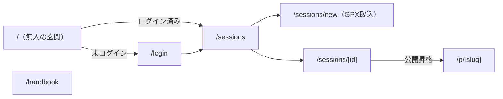
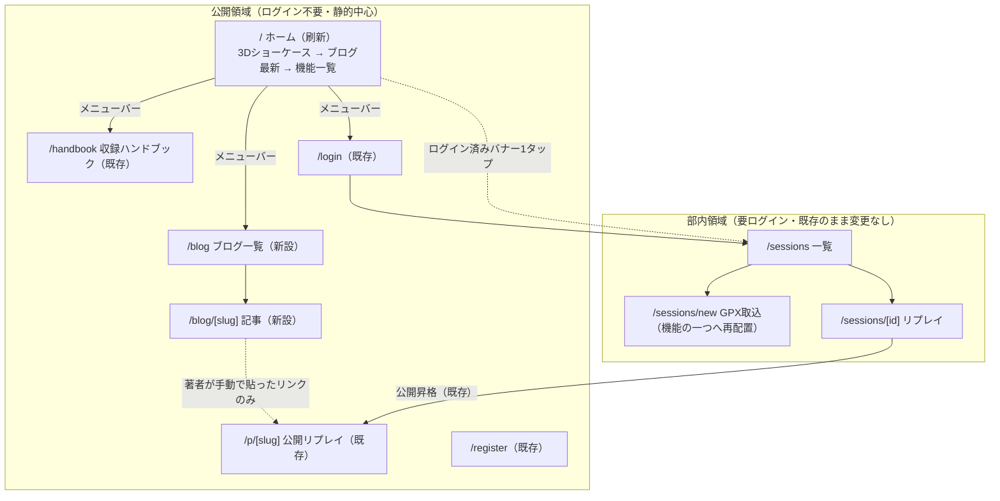

# PRD-rev8 — ホーム体験の刷新（3Dショーケース＋ブログ＋公開ナビゲーション）

<!-- 契約: 作成者 product-lead / 入力: オーナー要望（2026-07-28）＋裁定済み3点（事前レンダリング式・Markdownブログ・MVP後）＋PRD.md rev.6 §5-7＋SPEC-share1-phase1.md §3.2＋UI-DESIGN.md rev.6＋ARCH.md §1・ADR-007/008＋design-system rev.3＋TASKS.md実装ルール9項＋WebSearch調査（3Dモデル市場・ライセンス・スクロール連動手法） / 出力先: オーナー（Product Gate承認）→ 承認後 architect → 実装はCodex／毎朝ルーチン -->
<!-- 位置づけ: 承認前の提案書。本書は正本（PRD/ARCH/TASKS/UI-DESIGN）を書き換えない。正本の改訂が必要な箇所は本書内に「改訂案」として文案を置き、オーナー承認後にTeam Leadが正本へ反映する -->
<!-- 着手条件（オーナー裁定済み・動かさない）: ③Quality Gate通過とデプロイの後。7/31のMVP完成目標を崩さない -->

**日付**: 2026-07-28
**ステータス**: オーナー承認待ち（末尾「オーナーの承認が必要な事項」参照）

---

## 0. 前提 — 裁定済みの3点（本書では蒸し返さない）

| 論点 | オーナー裁定 |
|---|---|
| 3Dの実現方式 | **事前レンダリング式**。Blenderで高品質にレンダリングした360度画像列（または動画）をスクロールに連動させて表示する。WebGL/three.jsによるリアルタイム3D描画は導入しない |
| ブログの実装形態 | **リポジトリ内のMarkdown**を静的描画。DB・API・エディタ不要。410凍結済みのv2 articlesは復活させない |
| 優先順位 | **MVP完走後の新スライス**。③Quality Gate通過とデプロイの後に着手。7/31完成目標を崩さない |

---

## 1. 目的 — なぜこれを作るか

### 1.1 未解決問題への回答

2026-07-23にオーナー自身が言語化した問題:

> **「機能は問題ないが、第三者目線で使いたくなる未来が見えない」**（knowledge/topics/sailvlog.md）

v3ピボットはこの診断から始まったが、E2（リプレイ）は**中身**への回答であって、**入口**への回答ではない。現状の入口は次の状態にある:

- `/` はログイン状態を見て `/sessions` か `/login` へ**即座にリダイレクトするだけの無人の玄関**（`frontend/src/app/page.tsx`、T-26時の暫定措置）
- 部外の第三者（採用担当・他大学の部員・新入部員候補）が最初に見るのは**ログインフォーム**。プロダクトが何であるか・何が優れているかを語る面が1ページも存在しない
- 共有1で作った `/p/[slug]` は「個別セッションの出口」であり、プロダクト全体の顔ではない

つまり「第三者目線で使いたくなる未来」を見せる場所が、**構造的にゼロ**である。本刷新はその欠落への回答であり、GPX取込を「入口」から「機能の一つ」へ再配置する。

### 1.2 目的の序列（優先順に）

1. **初見の第三者に10秒でプロダクトの魅力を伝える面を作る**（採用担当・他大学へのデモの導入・新歓）。Phase 2着手条件「他大学1チームへ反省会デモ」（PRD §6）の実弾にもなる
2. **艇そのものの魅力で引き込む**。470/スナイプ/ILCAの高品質な3Dビジュアルは、セーラーには「自分の艇だ」という当事者性を、非セーラーには視覚的インパクトを与える。競合（raceQs/Njord）のLPは機能スクリーンショット中心で、艇のビジュアルを主役にした導入は不在 — ここは差別化として空いている
3. **ブログでプロセスを外部化する**。ピボットの意思決定・反省会での実利用・技術的知見を記事として置くことで、就活面接指標（PRD §6「意思決定記録がREADMEにある」）をREADMEの外＝一般公開面へ拡張する
4. **就活・ポートフォリオ価値**（ユーザーは28卒就活中）: 「性能予算を先に切ってから、事前レンダリング×スクロール連動を予算内に収めた」という計測駆動の実装経緯は、面接で語れる技術ストーリーになる。ホーム自体が「プロダクトの顔を設計できる」証拠物になる

### 1.3 作る価値の判断（Product Review・簡易版）

| 観点 | 評価 | 根拠 |
|---|---|---|
| 課題の実在性 | **高** | 「顔がない」は構造的事実（§1.1。`/` のコードで確認可能）。7/23のオーナー診断とPhase 2デモ需要（PRD §6）に直結 |
| 差別化 | 中〜高 | raceQs/Njord/TracTracのLPはいずれも機能訴求型。艇クラス（470/スナイプ/ILCA）を主役にした日本語の入口は不在。ただし「入口が良い」だけでは使われない（自己反論は§12） |
| 実現可能性 | **中（素材が律速）** | 実装は既存スタック内で成立（画像列＋標準ブラウザAPI）。**最大の不確実性は「超リアルな3Dモデル」の素材調達**（§8。クラス固有モデルは市場にほぼ流通していないことをWebSearchで確認済み） |
| 就活価値 | 高 | §1.2-4。加えてブログは「書ける素材」（ADR 12本・ピボット記録）が既に社内に存在し、供給源なき投稿箱（v1の失敗構造）にならない |
| リスク | 中 | スコープ膨張（v1同型・PRD第6リスクと同構造）と性能劣化。防波堤は§10「入れないリスト」と§9性能予算 |

---

## 2. 完成イメージ — ユーザーが何を見て・何を操作できるか

### 2.1 部外の初見者（ログインなし）

1. `https://…/` を開くと、**深い海の上に470の超リアルなレンダリング画像**が現れる。スクロールすると艇がゆっくり回転し（画像列のスクロール連動）、角度が変わりながらハル・リグ・セールのディテールが見える。艇名と一言（「470 — 二人で走らせる、オリンピッククラス」程度の短い事実）だけが添えられる
2. 艇種タブ（470 / スナイプ / ILCA）で表示する艇を切り替えられる（段階リリースにより、初期は1艇のみ）
3. 3Dショーケースの下へスクロールすると**ブログの最新記事カード（2〜3枚）**が現れる。「反省会をデバッガにした話」「なぜ2Dリプレイで十分なのか」のような、プロダクトと部活の実話
4. ページ上部には**メニューバー**が常設され、機能一覧（リプレイ / ブログ / 収録ハンドブック / ログイン）へ移動できる。ホーム下部にも機能紹介セクション（リプレイのスクリーンショット＋GPX取込＋注釈＋公開共有の4項目を1枚ずつ）
5. **ポリシー・理念・開発方針のような自己紹介文は置かない**（オーナー要望5）。語るのは艇・記事・機能の実物だけ
6. ホームは**バックエンドAPIに依存しない完全静的ページ**とする（要件）。Render無料枠のcold start（約1分）の影響を受けず、初見者が最初の1秒で待たされない

### 2.2 部員（ログイン済み）

- 部員の日常動線は従来どおり `/sessions` 直行（ブックマーク・下部タブバー）。**ホームを毎回経由させない**
- `/` を開いた場合は（リダイレクトせず）ホームが表示され、最上部に「セッション一覧へ →」の固定バナーが出る。1タップで日常動線へ復帰できる
- GPX取込は `/sessions` 内の「＋アップロード」ボタンとして存続（現行UI-DESIGN §2のまま変更なし）。「入口がGPX取込」だった状態は解消される

### 2.3 ブログの読者

- `/blog` で記事一覧（日付降順・カード）、`/blog/[slug]` で記事本文（Markdown静的描画）。読むだけ。コメント・いいね・検索・タグは存在しない
- 記事本文からは、著者（オーナー）が**手動で貼った** `/p/[slug]`（公開リプレイ）へのリンクを辿れる場合がある（§5.2の裁定参照）

---

## 3. 画面遷移の再構成

### 3.1 誰のためのホームか（本書の裁定案）

**主客は「部外の初見者」、部員は素通りできる設計**とする。

- 理由①: 部員には既に `/sessions` という完成した日常導線があり、そこに割り込む理由がない（毎回ホームを見せるのは部員の体験を悪化させるだけ）
- 理由②: ホームの目的（§1.2）はすべて部外向け。主客を混ぜると「部員向けダッシュボード」への膨張圧力が生まれる（v1同型の失敗経路）
- 具体裁定: **ログイン済みユーザーの `/` 自動リダイレクトは廃止**し、ホーム上部の「セッション一覧へ」バナーで代替する。ログイン成功後の遷移先は従来どおり `/sessions`（UI-DESIGN §1のまま）
- 対抗案（不採用）: 「ログイン済みは従来どおり `/sessions` へ自動リダイレクト」— 部員の1タップを節約できるが、部員自身がホーム（自分たちの艇と記事）を見る機会が構造的にゼロになり、ブログ供給のモチベーション（自分の記事が載る顔）も失われる。ただしこれは体験の好みの問題なので、**最終choiceはオーナー承認事項**（末尾①）

### 3.2 現在の遷移

### 3.3 新しい遷移

- **部内領域の画面・遷移は一切変更しない**（/sessions系・/p/[slug]・昇格ダイアログは現行のまま）
- `/p/[slug]` の「ログイン導線を強制しない」原則（UI-DESIGN §5.3）も現行のまま。公開ビューにホームへのリンクを足すかどうかはUI設計時の判断に委ねる（足す場合も「これは何?」の置き換えに留め、登録誘導はしない）

---

## 4. 実装する機能の一覧

| # | 機能 | 内容 |
|---|---|---|
| H-1 | 公開ホーム `/` | リダイレクト page.tsx を廃し、静的なホームページに置換。構成: ①3Dショーケース ②ブログ最新2〜3件 ③機能一覧セクション ④フッタ（GitHub・「これは何?」相当の1行のみ。ポリシー文なし） |
| H-2 | 3Dショーケース | 事前レンダリング画像列のスクロール連動表示（§7で技術説明）。艇種タブで切替（段階リリースにより初期1艇）。`reduced-motion` 時は静止画にフォールバック。デザインは design-system rev.3 の `--gradient-water-*` / `.ds-hero-water` 系トークンの上に載せる（海は常に深い、の原則を流用） |
| H-3 | メニューバー | 公開ナビ（ホーム / ブログ / ハンドブック / ログイン）。既存 TopBar / BottomTabBar との統合ルール（ログイン状態での出し分け・`/p/` 非表示ロジックとの整合）はUI-DESIGN改訂（rev.7）で確定 |
| H-4 | ブログ基盤 | リポジトリ内 `content/blog/*.md` を正本とし、ビルド時に静的生成。一覧 `/blog` ＋詳細 `/blog/[slug]`。frontmatter（title/date/summary）程度の最小構成 |
| H-5 | ホームのブログ帯 | 最新記事2〜3件のカードをホームに表示（ビルド時に確定。ランタイムfetchなし） |
| H-6 | 機能一覧セクション | リプレイ / GPX取込 / 注釈 / 公開共有 の4機能を、スクリーンショット静止画＋2行の説明で紹介。GPX取込はここで「機能の一つ」として提示される |
| H-7 | 初期記事3本 | オーナー執筆。候補: ①ピボットの意思決定記録（PRD/ADRの一般向け要約）②反省会での初回実利用レポート ③「なぜ3Dリプレイを作らないのか」（YAGNIの実話——§5.1の線引きをコンテンツ化できる） |

**テスト（deliverablesルール）**: H-2のフレーム選択・プリロード等の純関数ユニットテスト、H-4のMarkdown一覧生成のユニットテスト、公開ホームがAPI非依存で200を返すスモークを最低ラインとする（詳細はarchitect/TASKS分解時）。

---

## 5. 正本との衝突3件と、その扱い（気づかなかったふりをしない）

### 5.1 衝突①: PRD §5「3D表示・リアルタイムLIVE — YAGNI」の明示的除外

- **事実**: PRD §5「明示的に入れない」に「3D表示・リアルタイムLIVE — 反省会には2D事後再生で十分。YAGNI」がある。実装ルール3も「3Dは提案も不要」と定める
- **解釈**: この除外の理由文は「**反省会には**2D事後再生で十分」であり、除外が向けられているのは**再生エンジンの3D化**である。ホームの艇紹介は再生エンジンと無関係の静的コンテンツであり、しかも裁定済みの実現方式（事前レンダリング画像列）は技術的には「画像を順番に表示する」だけで、3Dランタイムを一切持ち込まない
- **明文化する線**:
  > **再生エンジン（`lib/replay/`・部内リプレイ・公開ビュー）は2D Canvasのまま一切変更しない。3Dはホーム画面の表現（事前レンダリング済み静止画像列）としてのみ存在し、WebGL/three.js等のリアルタイム3D描画は引き続き導入しない。**
- **PRD §5 改訂案**（オーナー承認後にTeam Leadが反映。現行行を以下に差し替え）:
  > - 3D表示・リアルタイムLIVE（**再生エンジン**） — 反省会には2D事後再生で十分。YAGNI。リプレイ・公開ビューの再生エンジンは2D Canvasのまま変更しない。※ホーム画面の艇ショーケース（rev.8・事前レンダリング画像列の静的表示）は本除外の対象外だが、その実装においてもWebGL/three.js等のリアルタイム3D描画は導入しない（ARCH §1「新技術予算温存」と整合）
- **実装ルール3への追記案**: 「3D」の禁止対象を「再生エンジンの3D化・リアルタイム3D描画」と明確化し、rev.8のホーム画像列を例外として1行追記

### 5.2 衝突②: SPEC §3.2「公開セッションの一覧・検索・タグを作らない／入口はURL1本」

- **事実**: 共有1の防波堤として「公開セッションの一覧ページ・検索・タグは作らない。入口はURL1本に限定する」（SPEC §3.2、実装ルール8で禁止事項に昇格済み）。ブログは公開セッション一覧そのものではないが、「部外が探索できる面を作る」方向では隣接する
- **裁定（本書の提案）**: **ブログから公開セッションへの導線は「著者が記事本文に手動で貼るリンク」に限って可**とする。理由: これは共有0（手動でX/noteにURLを貼る）と同型の**編集行為**であり、システムが公開セッションを列挙する機能ではない。むしろ記事×公開URLの組み合わせは、共有1の計測（実送付・部外閲覧）の自然な供給路になる
- **防波堤（明記）**:
  1. **ブログに公開セッションの自動一覧・自動埋め込み・「公開中のセッション」ウィジェットを作らない**。`/blog` や `/` が `Session` テーブルを参照する実装を書いた時点で本防波堤の突破とみなし、SPEC §3.2違反として差し戻す
  2. ブログの検索・タグ・カテゴリも作らない（記事が月2本ペースなら一覧で足りる。YAGNI）
  3. SPEC §3.2の本文は**改訂不要**（「公開セッションの一覧・検索」の禁止は現状のまま生きる）。実装ルール8の「作らないもの」リストに「ブログからの公開セッション自動列挙」を1項追加する改訂案のみ提示する

### 5.3 衝突③: v2 articles/questions は T-01で410凍結・T-26でフロント削除済み

- **事実**: 旧記事機能はルート410（ADR-003）・フロントは `archive/v2-frontend` に退避の上で削除済み。新ブログの復活と混同されるリスクがある
- **明記（1行）**: **新ブログはリポジトリ内Markdownのビルド時静的描画であり、410凍結済みのArticle/Question（DB保存・投稿エディタ・いいね・ユーザー投稿）とは実装・データ・概念のすべてで無関係。凍結の解除・復活は行わない**
- 補足: 書けるのはリポジトリにコミットできる人（実質オーナー）だけ。これは制約ではなく設計意図——v1が死んだ「供給源なき投稿箱」構造（PRD §5）を避け、供給者を1人に固定した編集メディアとして始める。部員投稿が必要になったらそれは共有2（構造化投稿）の議題であり、ブログの拡張では対応しない

---

## 6. ファイル変更一覧

現行ルート: `/`, `/login`, `/register`, `/sessions`, `/sessions/new`, `/sessions/[id]`, `/handbook`, `/p/[slug]`（9ルート・First Load JS 87KB）。**部内領域のファイルには触れない。**

| 区分 | パス | 何をするか |
|---|---|---|
| 変更 | `frontend/src/app/page.tsx` | ログイン状態リダイレクトを廃止し、公開ホーム（サーバコンポーネント・静的）に全面置換。3Dショーケース＋ブログ帯＋機能一覧を配置。ログイン済み判定の「セッション一覧へ」バナーのみクライアント側 |
| 新規 | `frontend/src/components/home/BoatShowcase.tsx` | スクロール連動画像列ビューア（クライアントコンポーネント）。フレーム選択・プリロード・reduced-motion静止画フォールバック |
| 新規 | `frontend/src/components/home/FeatureSection.tsx` | 機能一覧セクション（静止画＋説明文） |
| 新規 | `frontend/public/boats/<class>/frame-*.webp` | 事前レンダリング画像列アセット（艇種ごとのディレクトリ。§9の予算内に収める） |
| 新規 | `frontend/public/screenshots/*.webp` | 機能紹介用スクリーンショット静止画（3〜4枚） |
| 新規 | `content/blog/*.md`（または `frontend/content/blog/`。位置はarchitect裁定） | 記事の正本（frontmatter: title / date / summary） |
| 新規 | `frontend/src/lib/blog.ts` | ビルド時にMarkdownを列挙・パースする純関数（一覧・詳細の共通データ源）。描画は既存 `react-markdown`（/handbookで実績あり）の流用が自然だが、静的生成との相性を含め最終選定はarchitect |
| 新規 | `frontend/src/app/blog/page.tsx` | 記事一覧（静的生成） |
| 新規 | `frontend/src/app/blog/[slug]/page.tsx` | 記事詳細（静的生成＋OGP。共有1の `generateMetadata` パターンを流用） |
| 変更 | `frontend/src/components/TopBar.tsx` / `BottomTabBar.tsx` | 公開ナビ（ホーム/ブログ/ハンドブック/ログイン）とログイン済みナビの出し分け。既存の `/p/` 非表示ロジックとの整合を保つ |
| 変更 | `frontend/src/app/layout.tsx` | metadata更新（ホームのOGP）。ナビ構成変更の反映 |
| 変更 | `docs/dev-org/PRD.md` §5・`TASKS.md` 実装ルール | §5.1/§5.2の改訂案を**オーナー承認後にTeam Leadが反映**（本書からは書き換えない） |
| 変更 | `README.md` / Q&A | ホーム・ブログの書き方（記事の追加手順=mdを置いてコミットするだけ）・画像列の作り方と予算をQ&Aに追記（deliverablesルール） |

**触れないもの**: `backend/` 全体（ホームはAPI非依存が要件）・`lib/replay/`・`/sessions` 系・`/p/[slug]`・design-systemのトークン正本（新トークンが必要なら design-system 更新として別コミット、rev.3の手順に従う）。

---

## 7. 新しく登場する概念・技術（オーナー向けの丁寧な説明）

| 用語 | 説明 |
|---|---|
| **スクロール連動アニメーション（scroll-driven image sequence）** | ページのスクロール量を「アニメーションの再生ヘッド」として使う手法。事前に艇を少しずつ回転させた画像を例えば36枚用意し、「ページを20%スクロールしたら36枚中8枚目を表示」のように、スクロール位置→フレーム番号を対応させて`<canvas>`や``に描く。Apple製品ページ（AirPods Pro等）で広く知られる手法（解説: [CSS-Tricks](https://css-tricks.com/lets-make-one-of-those-fancy-scrolling-animations-used-on-apple-product-pages/)）。**リアルタイム3D計算は一切しない**——ブラウザがやるのは「画像の差し替え」だけなので、リプレイCanvasで実証済みの技術範囲に完全に収まる。**応用**: リプレイ画面のタイムラインスクラブと概念が同じ（位置→時刻→フレーム）。面接で「同じ設計原理を2箇所で使った」と語れる |
| **画像列のプリロード** | スクロールした瞬間に次のフレームがまだダウンロード中だとカクつくため、ショーケースが画面に近づいた時点で全フレームを先読みしておく仕組み。ポイントは「ページを開いた瞬間には読まない」こと——`IntersectionObserver`（要素が画面に入ったことを検知するブラウザ標準API）で、必要になる直前に読み始める。これにより初期表示は軽いまま、スクロール時は滑らかになる |
| **WebP / AVIF** | JPEGより高圧縮な画像形式。同じ見た目でファイルサイズが2〜4割小さい。36枚の画像列では合計サイズに直結するため、予算（§9）を守る主要手段。Blenderからの書き出しはPNG→変換ツールで一括変換する |
| **`prefers-reduced-motion`** | OSの「視差効果を減らす」設定をCSS/JSから検知できる仕組み。design-system rev.3の `.ds-chart-drift` で既に採用済みのパターンをそのまま踏襲し、有効時はスクロール連動を止めて静止画1枚を表示する |
| **Next.jsの静的生成（SSG）とMarkdown描画** | 今の `/sessions` は「アクセスのたびにAPIからデータを取って描く」動的ページだが、ブログとホームは内容がデプロイ時に確定しているので、**ビルド時にHTMLを作り置き**できる（静的生成）。利点: ①表示が速い ②バックエンドが寝ていても（Render cold start中でも）即表示される ③サーバ負荷ゼロ。Markdown描画自体は `/handbook` で既に `react-markdown` を使っており、新しい概念ではない——変わるのは「Markdownをリポジトリのファイルから読み、ビルド時に全記事ぶんのページを作る」部分（`generateStaticParams` というNext.jsの仕組み）。**応用**: 技術ブログ・ドキュメントサイトの標準構成であり、Zenn/HugoなどのSSGと同じ原理 |
| **スクロールジャック（避けるべきもの）** | スクロール操作を乗っ取って意図しない位置に強制移動させる実装。酔い・苛立ちの原因になる。本ショーケースは「スクロール量を読むだけ」で、スクロール自体には介入しない（この線を実装要件とする） |

**技術選定の注意**: 上記は概念の説明であり、具体のライブラリ・実装方式の選定はarchitectの領分。ただし要件として **「新規npm依存の追加はTeam Lead承認制（実装ルール6）・依存ゼロで成立する見込みが高い（標準APIで足りる）」** を制約に含める。

---

## 8. 素材（3Dモデル）の調達計画 — 最大の実務リスク

### 8.1 調査結果（2026-07-28 WebSearch）

- **クラス固有モデル（470/スナイプ）は市場にほぼ流通していない**。[TurboSquid](https://www.turbosquid.com/Search/3D-Models/dinghy)・[CGTrader](https://www.cgtrader.com/3d-models/dinghy) に「dinghy」カテゴリはあり（各200〜300点）、汎用セーリングディンギーは$50〜$179程度で買えるが、「470」「Snipe」のクラス指定検索では該当モデルが確認できなかった（TurboSquidの"snipe"検索はドローンがヒットする状態）
- **ILCA/Laserのみ無料モデルが存在**するが、3Dプリント用STL（[Printables](https://www.printables.com/model/292583-laser-ilca-sailing-dinghy-boat)等）で**テクスチャ・マテリアルなし**。「超リアル」品質にはBlenderでのマテリアル・セール・リギング作業の上乗せが必須
- **ライセンス**: TurboSquidのRoyalty Freeライセンスは「独立してレンダリングした画像」のWebサイト掲載・商用利用を明示的に許可（[公式FAQ](https://www.turbosquid.com/help/en/articles/9937423-royalty-free-license-faq)、[ライセンス本文](https://www.turbosquid.com/licensing)）。**モデルファイル自体の再配布は不可**——「画像列だけを公開し、.blendファイルはリポジトリにコミットしない」運用にすれば適合する。CGTraderも同建付けだが**モデルごとにライセンス表記が異なるため購入前に個別確認**。無料STLはCCライセンスの条項（表示義務・NC・改変可否）を個別確認しダウンロード元と条項を記録すること

### 8.2 調達の選択肢と見積もり（作業者は全てオーナー本人）

| 案 | 内容 | 費用 | オーナー所要時間（1艇あたり） | 「超リアル」到達度 |
|---|---|---|---|---|
| A. 購入＋改修 | 汎用ディンギーモデルを購入し、Blenderでセール番号・カラーリング・リグ形状を自艇種に寄せる | $50〜180/艇 | 8〜16時間（Blender経験が浅い場合は+50%） | 中〜高（ベース品質依存。クラスの形状correctnessは妥協が残る） |
| B. 自作（Blender） | 実艇の採寸・写真からモデリング。ILCAはハル形状が単純で最も現実的 | 0円 | **40時間以上/艇**（初学者。ハル+リグ+セール+マテリアル+ライティング）。3艇なら月単位 | 到達可能だが最も遠い |
| C. 外注 | Fiverr/ココナラ等で艇1隻のモデリング＋レンダリングを依頼。**Web公開可のライセンスを契約に明記** | $100〜500/艇（品質次第で上振れ） | 依頼管理2〜4時間＋納期1〜3週間 | 高（要件伝達の質に依存） |
| 共通の後工程 | Blenderでターンテーブル・レンダリング（36フレーム）→WebP一括変換→予算内圧縮 | 0円 | 4〜8時間/艇（ライティング調整含む） | — |

- **推奨: 1艇目はA案（購入＋改修）またはC案**。B案（フル自作）は7〜8月の就活・部活と両立しない規模であり、「超リアル」の期待値に最も届きにくい
- **3艇を最初から揃えない。1艇から始められる設計を要件とする**（H-2の艇種タブは1艇でも成立するUI。データは `public/boats/<class>/` のディレクトリ追加だけで増やせる構造にする）。どの艇から始めるかはオーナー選択（承認事項③。判断材料: 素材の入手しやすさはILCA ＞ 470 ≈ スナイプ、ホームの顔としての優先度はオーナーの主戦艇種）
- **確認事項として明記（ライセンス）**: 購入・依頼・無料DLのいずれでも、①Web公開（レンダリング画像の掲載）可否 ②商用可否（就活ポートフォリオは非商用だが、将来の運用変化に備え商用可を推奨） ③クレジット表記義務 ④モデルデータ自体の再配布禁止への適合（=リポジトリに.blend/.objをコミットしない） の4点を**購入前に**確認し、調達記録（URL・ライセンス種別・日付）を `docs/` に1行残す

### 8.3 最大リスク仮説と安い検証

- **最大リスク仮説**: 「『超リアル』水準の470/スナイプ/ILCAモデルが、費用・時間の予算内で手に入らない」
- **安い検証（実装着手前・オーナー作業・半日）**: マーケットプレイスを実際に閲覧し、**候補モデル3件のURL・価格・ライセンス・プレビュー画像**を収集する。3件集まらなければ、Stage 1の中身を「実艇の高品質写真（部の470を晴天順光で撮影）」に差し替えてホーム刷新自体は前進させ、3Dは外注見積もりが取れてから再開する。**素材が無いままH-2の実装を始めない**（実装が先行すると「仮画像のまま公開」という中途半端な顔になる）

---

## 9. 性能予算（先に数値で切る。「重かったら考える」はしない）

前提: 現行フロントの First Load JS は **87KB**（shared）。読者はモバイル回線（4G実効 5〜10Mbps想定）の学生・採用担当。ホームはRender cold startの影響を受けない静的構成（§2.1-6）。

| 項目 | 予算（上限） | 根拠・備考 |
|---|---|---|
| ホームの初期表示転送量（スクロール前に読む分。HTML+CSS+JS+ヒーロー静止画1枚） | **合計 700KB** | 4G実効5Mbpsで約1.1秒。ヒーロー静止画（画像列の1枚目）はWebP 1600px・**200KB以下** |
| ホームのJS増分 | **+15KB（gzip）以下** | 新規npm依存なし・標準API実装なら余裕で収まる。87KB→100KB強を超えない |
| 3D画像列（1艇・遅延読み込み分） | **2.5MB以下**（例: 36フレーム × 平均70KB WebP） | ショーケースが画面に近づいてから読み込む（プリロード§7）。初期表示予算には含めない |
| ホーム全体（1艇構成・全スクロール時の総転送量） | **3.5MB以下** | 画像列2.5MB＋初期700KB＋機能紹介静止画300KB |
| 複数艇時 | 同時に読み込むのは**常に1艇分のみ**（タブ切替時にオンデマンド読み込み）。ページ総量の自動読み込み上限は1艇構成と同じ3.5MB | 3艇ぶん7.5MBを勝手に読まない |
| 体感指標 | モバイル実機でホームのLCP（最大コンテンツ描画）**2.5秒以内**・スクロール連動中も目視でカクつきなし | Lighthouseで計測し数値をTASKSに追記（リプレイの55fps実測と同じ流儀） |

**予算超過時の縮退順序**（この順で削る。順序も予算の一部）:
1. フレーム数 36 → 24 → 16（回転の滑らかさを落とす。16枚でも回転は成立する）
2. 解像度 1600px → 1200px → 960px
3. それでも超えるなら**スクロール連動を捨て、静止画3アングル（正面・横・リグ寄り）のフェード切替**へ縮退（画像3枚=600KB以下。ホームの成立自体は守る）

動画方式（スクロール連動の代わりに短尺ループ動画）を選ぶ場合も同じ予算枠（1艇3MB・自動再生はミュート・`preload="none"`）を適用する。画像列/動画の方式選定はarchitect裁定に委ねるが、**予算はこの表が正**。

---

## 10. 明示的に入れない（ホーム刷新の防波堤）

- **WebGL / three.js等のリアルタイム3D** — 裁定済み。事前レンダリングのみ
- **再生エンジンへの一切の変更** — `lib/replay/` は読みもしない（§5.1の線）
- **ブログのDB・投稿エディタ・コメント・いいね・タグ・検索・RSS** — Markdownの静的描画のみ。v1の投稿箱構造を再演しない
- **公開セッションの自動一覧・ウィジェット** — §5.2の防波堤。ブログからの導線は手動リンクのみ
- **ポリシー・理念・開発方針などの自己紹介文** — オーナー明示要望。語るのは実物のみ
- **アクセス解析ツール（GA等）の導入** — PRD §5-7非KPI原則の延長。閲覧数を測る装置を持たない（§11の計測は閲覧数に依存しない設計にした）
- **部員向けダッシュボード化**（ホームへのセッション数・注釈数などの内部数値表示） — 主客（部外初見者）を濁す
- **多言語化・CMS連携・ニュースレター** — YAGNI
- **v2 articles/questionsの復活** — 裁定済み（§5.3）

---

## 11. 段階リリース（1艇＋静止画から始めて増やす）

| Stage | 内容 | 実装見積 | オーナー作業 | 完成条件（次へ進む関所） |
|---|---|---|---|---|
| **Stage 0: 骨格** | 遷移再構成（リダイレクト廃止・メニューバー・機能一覧セクション）＋ブログ基盤（/blog・/blog/[slug]）＋初期記事1本＋ヒーローは**静止画1枚**（実艇写真または仮レンダ1枚） | 2〜2.5日 | 記事1本執筆（2〜3h）＋写真1枚 | ①9ルート→11ルートでビルド成功・既存ルートの回帰なし ②初期表示予算700KB以内を実測 ③初見者テスト: 部外の3人に見せ「何のプロダクトか」が説明なしで伝わる |
| **Stage 1: 1艇ショーケース** | 1艇分の画像列スクロール連動（H-2本実装）＋reduced-motionフォールバック | 1〜1.5日 | **素材調達検証（§8.3・半日）→調達→レンダリング＋変換（0.5〜2日、A/C案前提）** | ①1艇構成でページ総量3.5MB以内・LCP2.5s以内を実測 ②オーナー実機（スマホ）でカクつきなし ③素材ライセンス記録が残っている |
| **Stage 2: 3艇化** | 艇種タブの実データ化（470/スナイプ/ILCA出揃い）＋記事3本目 | 0.5日 | 残り2艇の素材（各0.5〜2日＋外注なら納期） | ①タブ切替がオンデマンド読み込みで予算内 ②Stage 1の完成条件を3艇で再確認 |
| **Stage 3: 磨き（任意）** | ブログOGP画像の充実・機能紹介のGIF化など | 適宜 | — | 着手前にStage 0〜2の反応（§12計測）をオーナーがレビューし、続ける価値を判断 |

- **Stage 0だけでも「入口の問題」は解消する**（GPX取込は機能の一つになり、顔とブログができる）。素材調達が難航してもStage 0は独立して価値が出る——これが1艇から始められる設計の意味
- 各Stageは1コミット群として完結させ、途中で放置されても前Stageの状態で公開に耐えること（可逆性）

---

## 12. 計測 — 「効いた」をどう判断するか（非KPI原則と矛盾させない）

PRD §6の非KPI原則（閲覧数・フォロワー数を成功指標にしない）を継承し、**ホームのPV/滞在時間は測らない・成功指標にしない**。代わりに:

| 指標 | 測り方 | 判定 |
|---|---|---|
| ①伝達テスト（主指標） | 部外の初見者5人（就活の面接・逆質問、他大学部員、非セーラーの友人）にホームURLだけを渡し、「これが何のプロダクトで、誰のためのものか」を口頭で言ってもらう | 5人中4人が10秒以内に概ね正答すれば成功。3人以下なら構成を直す |
| ②他大学デモでの使用 | Phase 2着手条件のデモ（PRD §6）でホーム→公開リプレイの順に見せ、先方の反応を部内記録に1行残す | デモの導入としてホームが実際に使われたか（Yes/No） |
| ③ブログの供給継続 | 記事数（リポジトリのコミットで数える。SQLも解析ツールも不要） | 月1本×2ヶ月継続。途切れたらブログ帯の位置づけを再考（顔に「最終更新3ヶ月前」が載るのは逆効果） |
| ④技術予算の遵守（回帰） | ページ総量・LCPをリリース時と変更時に手動計測しTASKSへ追記 | §9予算内。超過はリリースブロッカー |

- ①は費用ゼロ・1週間で回る「安い検証」であり、ホーム刷新の最大リスク仮説「**顔を作っても第三者に刺さらない**」の直接検証になる
- 就活面接指標（PRD §6）への追記案: 「公開ホーム＋ブログにより、面接官がログインなしでプロダクトの全体像と意思決定記録に到達できる」を面接価値の項に加える（オーナー承認後にTeam Lead反映）

---

## 13. リスクと自己反論（説得耐性）

| リスク | 深刻度 | 対処 |
|---|---|---|
| **素材調達が律速になり、実装だけ先行して「仮画像の顔」で止まる** | **高** | §8.3の事前検証を実装着手の前提条件にする。Stage 0を素材非依存で切り出した |
| スコープ膨張（v1同型・共有1前倒しと同じ構造の再演） | 高 | 着手条件（Quality Gate通過＋デプロイ後）を動かさない。§10の入れないリストを実装ルールへ転記。ブログ強化・アニメ磨き込みの提案はStage 3の関所で止める |
| 性能予算超過でモバイル初見者が離脱 | 中 | §9で先に予算を切り、縮退順序まで固定した |
| ホーム経由の部員動線が混乱する（リダイレクト廃止の副作用） | 低 | バナー1タップで復帰。不評ならリダイレクト復活は1コミットで可逆 |
| 7/31競合 | 中 | 本件はMVP後の新スライス（裁定済み）。7/31までは**本書の承認以外の作業を発生させない** |

**product-leadによる自己反論（GO推奨への最強の反論）**:
> 「ホーム刷新は、MVPの最大リスク『データ供給が続くか』（PRD §7）を1ミリも解決しない。8週間の計測が始まる前に見た目へ投資するのは、v1で『機能を足せば使われる』と誤認したのと同じく『入口を良くすれば使われる』という未検証の願望では? 就活の見栄えが目的なら、READMEとデモ動画の充実の方が安い」
>
> — 正当な指摘であり、だからこそ本書は①MVP後という順序を動かさず ②Stage 0（2.5日）で最小の顔だけ作って伝達テスト（§12-①）にかけ ③刺さらなければStage 1以降（素材投資）を止められる構造にした。ホームは供給問題の解ではなく、**Phase 2（他大学展開）と就活面接という既に存在する2つの「見せる場」への投資**である、が反駁。ただしこの反駁の妥当性を最終判断するのはオーナーである。

---

## 14. オーナーの承認が必要な事項

1. **ホームの主客と部員動線**（§3.1）: 「主客=部外初見者・ログイン済みの自動リダイレクト廃止＋『セッション一覧へ』バナー」案でよいか。対抗案（ログイン済みは従来どおり自動で/sessions）を選ぶことも可
2. **PRD §5の改訂可否**（§5.1）: 「3D表示」除外項目の差し替え文案の承認（再生エンジンは2Dのまま・ホームの事前レンダリング画像列のみ対象外、の明文化）
3. **どの艇から始めるか**（§8.2）: 470 / スナイプ / ILCA のうちStage 1の1艇目。あわせて調達方式（A:購入+改修 / C:外注。B:フル自作は非推奨）と**素材予算の上限額**（目安: A案なら$50〜180、C案なら$100〜500/艇）
4. **素材調達の事前検証**（§8.3）: 実装着手前に「候補モデル3件のURL＋ライセンス収集（半日）」をオーナー作業として実施することの了承。3件集まらない場合はStage 1を実艇写真に差し替える縮退の了承
5. **ブログ→公開セッション導線の裁定**（§5.2): 「著者の手動リンクのみ可・自動一覧は禁止」の防波堤でよいか
6. **性能予算**（§9）: 初期700KB / 1艇画像列2.5MB / ページ総量3.5MB / LCP2.5s の数値と縮退順序の承認
7. **段階リリースの区切り**（§11）: Stage 0→1→2の関所（完成条件）と、「Stage 0のみでも公開する」方針の承認
8. **計測方法**（§12）: 伝達テスト5人・PVを測らない方針の承認
9. **着手時期の再確認**: ③Quality Gate通過＋デプロイ完了後（裁定済みの確認のみ。7/31以前に実装作業は発生させない）

---

## 15. DoD（本書の完了条件）

- [x] 目的が7/23の未解決問題への回答として位置づけられている（§1.1）
- [x] 完成イメージ・画面遷移（Mermaid）・誰のためのホームかの裁定案がある（§2・§3）
- [x] 機能一覧・ファイル変更一覧が具体（§4・§6）
- [x] 初出の概念・技術に丁寧な説明がある（§7）
- [x] 正本との衝突3件を正面から扱い、改訂案・防波堤・1行明記を提示した（§5）
- [x] 素材調達計画（入手経路・ライセンス・作業者と時間・1艇から始める設計）がある（§8）
- [x] 性能予算が数値で先に切られ、縮退順序がある（§9）
- [x] 段階リリースと各段階の完成条件がある（§11）
- [x] 計測が非KPI原則と矛盾しない（§12）
- [x] 最大リスク仮説と安い検証、GO推奨への自己反論がある（§8.3・§13）
- [ ] **オーナー承認（Product Gate）** — §14の9項目への回答をもって通過とする
