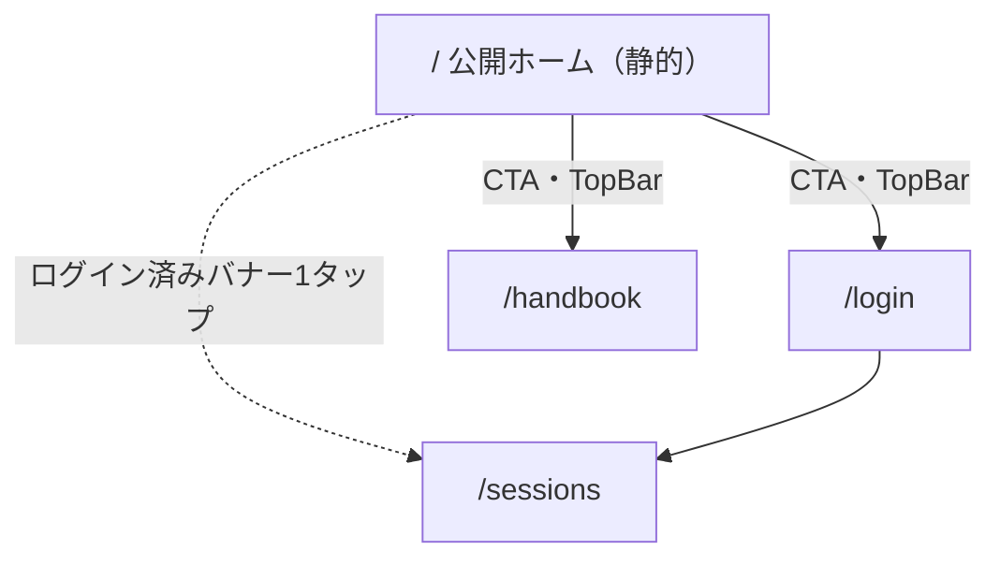

# SPEC: 公開ホーム画面（静止画版）

Status: Draft（Architecture Gate 未通過）
作成: architect / 2026-08-01
元設計: PRD-rev8-home-experience.md（オーナー裁定 2026-08-01 により縮小。GATES.md 記録済み）

## 1. 目的

### 1.1 なぜ作るか（実測された問題）

- 現在の `/` は `frontend/src/app/page.tsx` の `router.replace()` による**振り分けだけの無人の玄関**（`return null`）。未ログインの部外者は何の説明もなく `/login` へ飛ばされる
- 「これは何のプロダクトか」を語る画面が**構造的にゼロ**（PRD-rev8 §1.1 の診断のまま）
- 見せる場は既に2つ実在する: ①就活面接・ポートフォリオ（28卒・PRD §6）②他大学への反省会デモ（Phase 2 着手条件）。URLを渡した瞬間に相手が見る面が、現状は「無説明のログインフォーム」という負の状態

### 1.2 スコープ（オーナー裁定 2026-08-01・GATES.md「追加1週間スプリントのスコープ裁定」）

PRD-rev8 の縮小版。**3Dショーケース・ブログ関連は作らない。**

| PRD-rev8 | 今回 | 理由 |
|---|---|---|
| H-1 公開ホーム `/` | **作る** | 本仕様の主体 |
| H-2 3Dショーケース | **作らない** → 実スクリーンショット静止画（`hero-public-replay.jpg`）に置換 | 3Dモデル調達（Issue #15/#16）はリリース後へ延期 |
| H-3 メニューバー | **作る**（ブログ項目は除く） | — |
| H-4/H-5/H-7 ブログ基盤・ブログ帯・初期記事 | **作らない** | オーナー裁定: 「ブログ＝共有2の部員投稿（`/posts`）」と確定。オーナー執筆の読み物は不採用 |
| H-6 機能一覧セクション | **作る** | — |

**結果、ホームの構成は「ヒーロー画像 ＋ 機能一覧 ＋ ログイン導線 ＋ フッタ」。**

### 1.3 設計上の絶対要件

1. **API非依存。** ホームはバックエンドを1回も叩かない完全静的ページ（本番 cold start 12.5秒〔受容済み・GATES.md〕の影響をゼロにする）
2. **公開ビュー `/p/[slug]` の原則を壊さない。** `/p/` にナビが出る変更は絶対にしない（T-33・UI-DESIGN §5.3）
3. **新素材の撮影を前提にしない。** `frontend/public/screenshots/` の既存9点（DEMO-ASSETS.md）のみで構成する

## 2. 完成イメージ

### 2.1 部外の初見者（未ログイン）

1. `https://sailvlog.vercel.app/` を開くと、**深い海のグラデーション**（design-system `--gradient-water-deep` 系トークン）の上に、プロダクト名・1行の説明（例: 「大学ヨット部の反省会のための、複数艇GPXリプレイ・デバッガ」）と、**実際に6艇が再生中の公開ビューのスクリーンショット**（`hero-public-replay.jpg` 1033x706）が表示される。待ち時間ゼロ（バックエンドを起こさない）
2. ヒーロー直下にCTA2つ: 「ログイン」（部員向け・primary）と「収録ハンドブックを読む」（部外者が唯一ログインなしで読める実物・ghost）
3. スクロールすると**機能一覧セクション**: リプレイ / GPX取込 / 注釈 / 公開共有 の4機能を、実画面スクリーンショット1枚＋2行の説明で紹介
4. 最下部にフッタ: GitHubリポジトリへのリンクと「これは何?」相当の1行のみ。ポリシー・理念・自己紹介文は置かない（PRD-rev8 オーナー要望5を継承）
5. 上部メニューバー（既存TopBarの拡張）: ロゴ（→ `/`）／ハンドブック／Login／Join

### 2.2 部員（ログイン済み）

- `/` を開くと（リダイレクトせず）同じホームが表示され、**最上部に「セッション一覧へ →」バナー**が出る。1タップで日常動線へ復帰（裁定は §4.1）
- 日常動線（ブックマーク・ログイン成功→`/sessions`・下部タブバー）は**一切変更しない**

### 2.3 画面遷移（変更点のみ）

部内領域（`/sessions` 系）と `/p/[slug]` の遷移は現行のまま。

## 3. 実装する機能の一覧

| # | 機能 | 内容 |
|---|---|---|
| HS-1 | 公開ホーム `/` | リダイレクトを廃し、静的なサーバコンポーネントに全面置換。構成: ヒーロー → CTA → 機能一覧 → フッタ。API呼び出しゼロ |
| HS-2 | ヒーロー | `--gradient-water-deep` 背景＋`hero-public-replay.jpg`＋見出し・1行説明。LCP対象として最優先読み込み（§4.3） |
| HS-3 | 機能一覧セクション | 4カード（リプレイ=`replay-annotated-desktop.jpg` ※下記注 / GPX取込=`gpx-import-desktop.jpg` / 注釈=`replay-annotated-desktop.jpg` / 公開共有=`public-view-desktop.jpg`）。各2行説明。ビューポート外は遅延読み込み |
| HS-4 | ログイン済みバナー | クライアントコンポーネント。`isLoggedIn()`（localStorage）で判定し「セッション一覧へ →」を最上部に表示 |
| HS-5 | 公開ナビ統合 | TopBar拡張＋BottomTabBarのホーム非表示（裁定は §4.2）。`/p/` の非表示ロジックは不変 |
| HS-6 | ホームのOGP | `export const metadata` でタイトル・説明・`og:image`（ヒーロー画像を流用）。動的生成はしない |
| HS-7 | フッタ | GitHubリンク＋1行説明。以上 |

**HS-3 の画像割当注**: 「リプレイ」カードには `replay-hero-desktop.jpg`（6艇再生中・58KB）を使い、「注釈」カードに `replay-annotated-desktop.jpg`（反省メモ2件付き・65KB）を使う。DEMO-ASSETS.md で `replay-hero-desktop.jpg` は「ヒーロー不可（ログインUI写り込み）」とされているが、機能一覧の小さいカード用途は同ファイルの「用途: 機能紹介用」の指定どおりであり問題ない。

## 4. 設計裁定（ADR相当）

### 4.1 ログイン済みユーザーの `/` の扱い — **リダイレクト廃止・ホーム表示＋バナー**

**裁定: 自動リダイレクトを廃止し、ホームを表示して最上部に「セッション一覧へ →」バナーを出す**（PRD-rev8 §3.1 案のまま。この論点は承認事項①として 2026-07-30 にオーナー承認済みであり、本裁定は静止画版でもそれを維持するという確認）。

理由:

1. **部員の毎朝動線は `/` を通らない。** 日常入口はブックマーク（`/sessions` 直）・下部タブバー・ログイン成功後の自動遷移（→`/sessions`、変更なし）。`/` に来るのは「素のドメインを打った」例外ケースだけで、そこにバナー1タップが挟まっても毎朝のコストにはならない
2. **現行リダイレクトは速くない。** 現実装はクライアント側 `useEffect` での `router.replace()` であり、JS実行後にもう1画面ロードする（白画面→遷移）。静的ホーム＋バナーは「即座に何かが見える」点でむしろ体感が良い
3. **リダイレクト維持だと部員がホームを永久に見ない**。デモ・新歓で「うちのアプリの顔」を部員自身が知らない状態になる
4. **可逆。** 不評ならリダイレクト復活は1コミット（HS-4 のバナーを `router.replace` に戻すだけ）

対抗案（不採用）: リダイレクト維持。部員の1タップを節約できるが、上記1・2のとおり節約量は実質ゼロで、ホームの存在意義（見せられる顔）を部員から隠す欠点が残る。

実装注意: バナーは localStorage 判定のためハイドレーション後に出現する（未ログイン表示→バナー出現の順）。**レイアウトシフトを避けるため、バナーはヒーローの上に被せる固定表示（またはバナー分の高さを予約）とし、本文を押し下げない**こと。

### 4.2 ナビゲーション統合ルール — **`/p/` ロジック不変・ホームはタブバー非表示・TopBar拡張**

現状: `TopBar.tsx` と `BottomTabBar.tsx` はともに `pathname.startsWith("/p/")` で `null`（T-33）。BottomTabBar はモバイル幅のみ表示（CSS）で、項目は `config/navigation.ts` の Sessions / Handbook。TopBar は未ログイン時 Login / Join を既に出している。

裁定（3点）:

1. **`/p/` の非表示ロジックには一切触れない。** 条件の書き換え・共通化リファクタも本タスクではしない（回帰リスクだけあって利得がない）。ただし判定を純関数として `lib` へ抽出し（§6）、「`/p/` でナビが出ない」ことをユニットテストで固定する — 原則を「コメント」から「自動検知」へ格上げする
2. **BottomTabBar は `/`（完全一致）でも `null` を返す。** 理由: 未ログインの部外者に「⛵Sessions」タブを見せると、押した先はログイン要求＝壊れた約束になる。ログイン済み部員にはホーム上のバナーが `/sessions` 導線として十分。ログイン状態でタブバーを出し分ける案は、localStorage 判定によるハイドレーション後のタブバー出現（下からニュッと出る）というちらつきを生むため不採用
3. **TopBar が H-3 のメニューバーを兼ねる**（新規ナビコンポーネントは作らない・YAGNI）。変更は2点のみ:
   - ロゴのリンク先を `/sessions` → **`/`** に変更（Web標準の期待に一致。部員がロゴを押した場合もバナー1タップで復帰でき、日常動線はロゴ経由ではない）
   - **未ログイン時のみ**「ハンドブック」リンクを Login / Join の並びに追加（ログイン済みのナビは現行のまま変更しない。部員のハンドブック導線は下部タブバーが既にある）

これで公開ナビは「ホーム（ロゴ）／ハンドブック／ログイン（Login/Join）」となり H-3 を満たす。`config/navigation.ts`（下部タブの項目定義）は**変更しない**。

### 4.3 性能予算（静止画版・数値で先に切る）

前提: First Load JS 87KB（現行 shared）・素材は既存JPG合計約380KB（ヒーロー90KB・機能一覧4枚 約200KB）・ホームはAPI呼び出しゼロ（cold start 12.5秒の影響なし）。PRD-rev8 §9 の予算（3D画像列2.5MB等）は静止画版では過大なので以下に置き換える。

| 項目 | 予算（上限） | 根拠・手段 |
|---|---|---|
| バックエンドAPI呼び出し | **0件**（要件・テストで固定） | §6 スモークで検証 |
| 初期表示転送量（HTML+CSS+JS+ヒーロー画像） | **400KB** | ヒーロー90KB実測＋既存バンドル。4G実効5Mbpsで約0.6秒 |
| ホームのJS増分 | **+5KB（gzip）以下** | ホーム本体はサーバコンポーネント（クライアントJSほぼゼロ）。クライアントはバナー1個のみ |
| ページ総量（全スクロール時） | **700KB以下** | 既存素材合計380KB＋バンドルで余裕あり。新画像を足す場合もこの枠内 |
| LCP（モバイル4G想定） | **2.5秒以内** | LCP要素＝ヒーロー画像。`fetchpriority="high"`・遅延読み込み禁止・`width`/`height` 明示。リリース時に Lighthouse で実測し数値を TASKS に追記 |
| CLS | 0.1未満 | 全 `` に `width`/`height` を明示。バナーはレイアウトを押し下げない（§4.1） |

**`next/image` の裁定: 使わない。素の `` を使う。**

- 根拠: `next.config.js` が `images: { unoptimized: true }` であり、`next/image` の主要な恩恵（リサイズ・WebP変換・srcset生成）が**現構成では全て無効**。得られるのは lazy 既定と width/height 強制だけで、それは素の `` で同等に書ける
- `unoptimized` を外す案は不採用: Vercel Image Optimization の課金枠と、Railway/standalone ビルド（sharp 依存）の両立検証が必要になり、90KB のJPGを縮めるためのコストとして見合わない（設定変更はスコープ外・現状維持）
- 具体則: ヒーロー＝``（lazyにしない）。機能一覧4枚＝``

縮退順序（予算超過時、この順で削る）: ①機能一覧の画像を4枚→2枚（リプレイ・公開共有を残す）②ヒーロー画像の再圧縮（品質を落とした再エンコードは可・撮り直しはしない）③ヒーローを画像なし（グラデーション＋テキストのみ）に縮退。

## 5. ファイル変更一覧

`backend/` は一切触れない。`design-system/theme.json` は読むだけ（新トークン不要の見込み。必要になったら design-system 更新として別コミット・rev.3 手順）。

| 区分 | パス | 何をするか |
|---|---|---|
| 変更 | `frontend/src/app/page.tsx` | リダイレクトを全削除し、公開ホーム（**サーバコンポーネント**・`"use client"` なし・fetchなし）に全面置換。`export const metadata` でホームのOGP（HS-6）。表示データは `lib/home.ts` から import |
| 新規 | `frontend/src/lib/home.ts` | ホームの表示データと純関数の正本: `HOME_FEATURES`（4カードの title / 説明2行 / 画像パス / alt）・`HERO_IMAGE` 定数。**テスト可能にするためコンポーネントから分離** |
| 新規 | `frontend/src/components/home/HomeBanner.tsx` | ログイン済みバナー（クライアントコンポーネント・HS-4）。`isLoggedIn()` 判定→「セッション一覧へ →」。レイアウトを押し下げない配置 |
| 新規 | `frontend/src/lib/navVisibility.ts` | `showBottomTabBar(pathname)` 純関数（`/p/` 配下 false・`/` false・その他 true）。**既存の `/p/` 挙動をテストで固定するための抽出** |
| 変更 | `frontend/src/components/BottomTabBar.tsx` | 判定を `showBottomTabBar()` 呼び出しに置換（挙動追加は「`/` で非表示」のみ。§4.2-2） |
| 変更 | `frontend/src/components/TopBar.tsx` | ①ロゴ href を `/` へ ②未ログイン時のみ「ハンドブック」リンク追加（§4.2-3）。`/p/` の `null` は不変 |
| 変更 | `frontend/src/app/globals.css` | ホーム用クラス（`.home-hero` `.home-features` 等）。色・間隔・角丸は既存CSS変数（theme.json 由来の `--gradient-water-deep` `--space-*` `--radius-*` 等）のみ使用。**ハードコード禁止（ADR-008）** |
| 新規 | `frontend/src/lib/__tests__/home-static.test.ts` | §6 のテスト（ファイル名の task-id 接頭辞は TASKS 分解時に Team Lead が採番） |
| 変更 | `README.md` | スクリーンショット掲載と Q&A 追記（「ホームはAPI非依存」「画像追加時の予算」）— deliverables ルール。実施は docs-writer |

**触れないもの**: `backend/` 全体・`frontend/src/lib/replay/`・`/sessions` 系・`/p/[slug]`・`/handbook`・`/login`・`/register`・`frontend/src/config/navigation.ts`・`frontend/src/app/layout.tsx`（サイト全体の既定 metadata は現行のままで足りる。ホーム固有の metadata は page.tsx 側に置く）・`next.config.js`。

## 6. テスト（deliverables ルール＝③Quality Gate の通過条件）

frontend は Vitest。既存 `frontend/src/lib/__tests__/*.test.ts`（純関数を import して `describe`/`it`）の書式に合わせる。

| # | テスト | 検証内容（「動く」の定義） |
|---|---|---|
| T-a | ナビ可視性ユニット | `showBottomTabBar("/p/abc")===false`（**T-33原則の自動検知化**）・`showBottomTabBar("/")===false`・`showBottomTabBar("/sessions")===true`・`showBottomTabBar("/handbook")===true` |
| T-b | ホームデータ整合ユニット | `HOME_FEATURES` が4件・全件に title / 説明 / alt が非空で存在・画像パスが `/screenshots/` 配下 |
| T-c | 素材実在スモーク | `HERO_IMAGE` と `HOME_FEATURES` の全画像パスが `frontend/public/` 配下に実ファイルとして存在する（`fs.existsSync`。パスのタイポ・素材消失の回帰を捕まえる） |
| T-d | API非依存スモーク | `frontend/src/app/page.tsx` のソースを読み、`"use client"`・`fetch(`・`apiFetch`・`NEXT_PUBLIC_API_URL`・`useEffect` のいずれも**含まない**ことを検証（静的解析スモーク。ホームがサーバコンポーネントかつAPI非依存であることの機械的な最低保証） |

- T-d は「ソース文字列検査」という粗い手段だが、レンダリング統合テスト基盤（jsdom + RSC）を新規導入するコスト（新規依存＝ADR-011承認制）に対し、捕まえたい回帰（誰かがホームにAPI呼び出しを足す）はこれで捕まる。基盤導入はしない（YAGNI）
- 手動検証（テスト外・TASKS の検証手順に記載）: バックエンドを**停止したまま** `npm run dev` でホームが完全表示されること／Lighthouse で LCP 実測（§4.3）

## 7. 新出概念の説明

| 用語 | 説明 |
|---|---|
| **LCP（Largest Contentful Paint）** | ページ内で最大の要素（本件ではヒーロー画像）が描画されるまでの時間。Googleの推奨は2.5秒以内。ヒーローを遅延読み込みにすると悪化するので、ヒーローだけは即時読み込みにする |
| **`fetchpriority="high"` / `loading="lazy"`** | ブラウザ標準の `` 属性。前者は「この画像を最優先でダウンロードせよ」（ヒーローに付与）、後者は「画面に近づくまでダウンロードするな」（スクロール下の機能一覧4枚に付与）。JSライブラリ不要 |
| **CLS（Cumulative Layout Shift）** | 読み込み中にレイアウトがガタつく量。`` に `width`/`height` を書くとブラウザが先に領域を確保するため防げる。ログイン済みバナーも同じ理由で「後から本文を押し下げない」配置にする |
| **サーバコンポーネント（静的）** | `"use client"` を付けない Next.js コンポーネント。ビルド時にHTMLが作り置きされ、クライアントJSをほぼ送らない。ホームが cold start の影響を受けない仕組みの土台。ログイン判定（localStorage）はサーバでは読めないため、バナーだけを小さなクライアントコンポーネントに分離する——「静的な骨格＋動的な小島」という Next.js の定石 |

（3Dショーケース削除により、PRD-rev8 §7 のスクロール連動・画像列プリロード・WebP変換等の概念は本仕様では登場しない。）

## 8. 作らないもの（スコープ外の継承）

PRD-rev8 §10「明示的に入れない」と SPEC-share1-phase1 §3.2 を全面継承した上で、本仕様での具体形:

- **3Dショーケース・スクロール連動アニメーション・画像列** — 縮小裁定どおり。リリース後の別スライス（Issue #15/#16）
- **ブログ（`/blog`・記事・ホームのブログ帯）** — 不採用確定。共有2（部員投稿 `/posts`）の議題と混同しない
- **公開セッションの一覧・検索・タグ・「公開中セッション」ウィジェット** — ホームが `Session` テーブル（＝バックエンド）を参照した時点で API非依存要件と SPEC §3.2 の二重違反。差し戻し対象
- **登録誘導の押し付け**（「登録して続きを見る」等）— Join ボタンは置くが、モーダル・追従バナー等で迫らない
- **動的OG画像生成** — 静的なヒーロー画像の流用のみ
- **いいね・ランキング・閲覧数表示・アクセス解析（GA等）** — 非KPI原則の継承
- **ポリシー・理念・開発方針の自己紹介文** — 語るのは実物（スクリーンショットと機能）のみ
- **新規npm依存** — ゼロで成立する設計（標準 `` 属性＋既存スタックのみ）。ADR-011
- **TopBar/BottomTabBar の構造リファクタ** — 変更は §4.2 の最小差分のみ

## 9. 不足素材・既知の制約

| 項目 | 状態 | 扱い |
|---|---|---|
| OGP画像（1200x630推奨） | **不足**。専用画像は未作成（DEMO-ASSETS「未検証・今後の課題」） | `hero-public-replay.jpg`（1033x706）を流用。比率1.46:1 は推奨1.91:1 と異なりSNSカードで上下トリミングされ得るが、新規撮影・画像加工はスコープ外。リリース後の改善候補として明記 |
| 真の390px幅モバイル確認 | **未実施**（Chromeが500px未満に縮小不可・DEMO-ASSETS既知の制約） | 実装後の検証は DevTools デバイスモードで行う（TASKS の検証手順に含める）。素材のモバイル版4点は500px幅撮影であり「厳密な390px証拠」ではないと認識しておく |
| ヒーローのモバイル最適画像 | 不足（デスクトップ撮影1033x706のみ） | 同一画像を縮小表示で使う。UIスクショのため小画面で文字が潰れるが、「6艇の航跡が同時再生されている」ことが伝われば足りる（ヒーローの仕事は精読ではなく雰囲気）。潰れが許容外なら縮退順序③（テキストヒーロー）へ |
| GitHubリポジトリURL（フッタ用） | 要確認 | 実装時に `git remote` / README から取得。公開リポジトリでない場合はフッタのリンクを外し1行説明のみとする |

## 10. PRDへの改訂提案（実施は Team Lead。本仕様からは書き換えない）

1. **PRD-rev8 冒頭へのステータス追記案**: 「2026-08-01 オーナー裁定（GATES.md）により縮小実施: H-1/H-3/H-6 を静止画版として実装（SPEC-home-static.md）。H-2 はリリース後（Issue #15/#16）。H-4/H-5/H-7 は不採用（ブログ＝共有2の部員投稿と確定）。§9 の性能予算は静止画版では SPEC-home-static.md §4.3 が正」
2. **PRD.md §5 の3D除外文の改訂（rev8 §5.1 案）は今回不要**: 静止画版は3D要素を一切含まないため、現行の「3D表示——YAGNI」条項と衝突しない。改訂は H-2 復活時（リリース後）まで保留
3. **UI-DESIGN.md rev.7 への反映案**: 公開ナビの出し分け（§4.2 の3裁定: `/p/` 不変・`/` タブバー非表示・TopBar 2点変更）を UI-DESIGN のナビゲーション節へ転記

## 11. 設計への反論と応答（説得耐性）

**反論①（最強）: 「そもそも部外者はこのURLに自然には来ない。ホームを作る価値があるのか。READMEとデモ動画の充実の方が安いのでは」**

前段は事実として認める。sailvlog に自然流入は無く、SEOも狙っていない。その上で:

- このホームは**自然流入用ではなく、URLを手渡す場面の受け皿**である。手渡す場面は既に2つ実在する（就活面接・ポートフォリオ提出／他大学への反省会デモ=Phase 2着手条件）。「来ない」のではなく「こちらから見せに行く」——そのとき現状は無説明のログインフォームが表示される。これは「価値ゼロ」ではなく**負の第一印象**であり、埋める価値は訪問数に依存しない
- README充実案との比較: READMEは面接官・エンジニアには届くが、他大学の部員・非エンジニアはGitHubを開かない。またREADME整備は本スプリントで別途進行中（docs-writer）であり二者択一ではない
- コスト側: 静止画版は素材調達済み・新規依存ゼロ・実装1日規模。3D版（素材調達が律速・オーナー半日作業）に対する縮小裁定そのものが、この反論への組織的な応答になっている
- ただし「刺さるか」は未計測。PRD-rev8 §12-① の伝達テスト（部外者に URL だけ渡して10秒で何のプロダクトか言えるか）を静止画版リリース後に実施し、刺さらなければ H-2（3D）への追加投資を止める判断材料にする

**反論②: 「BottomTabBar を `/` で消すのは、ログイン済み部員から Sessions タブを奪う」**

事実だが、影響はモバイルで `/` を開いた部員に限られ、その画面には最上部バナー（より大きい導線）がある。タップ数は同じ1回。逆に出し分け実装（localStorage判定）はちらつきとテスト面積を増やす。

**設計の最弱点（自己申告）**: T-d（API非依存スモーク）が**ソース文字列検査**であること。`page.tsx` が import した先のコンポーネントが fetch する形はすり抜ける。緩和策として「ホームの子コンポーネントは `HomeBanner` のみ・データは `lib/home.ts` の定数のみ」という構造制約を §5 に固定し、レビュー（②Design/③Quality Gate）で import 面を目視確認する。完全な保証はレンダリング統合テスト基盤が要るが、新規依存コストに見合わないと判断した（§6）。

---

## 付録: 実装タスクの目安（TASKS 分解時の参考・採番は Team Lead）

1. `lib/home.ts`＋`lib/navVisibility.ts`＋テスト4本（T-a〜T-d）— 先にテストから書ける
2. `page.tsx` 全面置換＋`HomeBanner`＋CSS
3. TopBar / BottomTabBar の最小差分
4. 手動検証: バックエンド停止で全表示・Lighthouse LCP・DevTools 390px・`/p/[slug]` にナビが出ないことの目視
5. README / Q&A（docs-writer）

間に合わない場合に削る順序: 付録4の Lighthouse 計測を後日化 → HS-6（OGP）→ TopBar のハンドブックリンク（ロゴ変更と Login/Join は既存で残る）。**HS-1〜HS-4 と T-a〜T-d は削らない**（これを削ると本仕様の目的自体が消える）。
