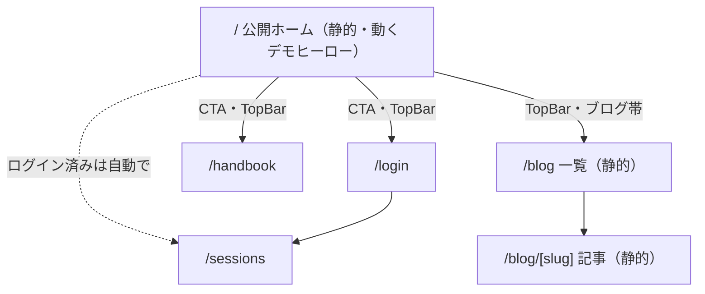

# SPEC: 公開ホーム画面（rev.2 — 動くデモヒーロー＋ブログ復活版）

Status: Draft（Architecture Gate 未通過）
作成: architect / 2026-08-01・**rev.2 改訂 2026-08-02**
元設計: PRD-rev8-home-experience.md（オーナー裁定 2026-08-01 により縮小 → **2026-08-02 の新裁定で一部復活・方針変更**）

> **ファイル名の注記**: 本ファイル名 `SPEC-home-static.md` の「static」は rev.1（静止画版）の名残。rev.2 でも「バックエンドAPI非依存＝静的配信」という意味では正しいため改名しない。

## 改訂履歴

| rev | 日付 | 変更 |
|---|---|---|
| 1 | 2026-08-01 | 静止画版として初版（3D・ブログを落とし1日規模に縮小） |
| 2 | 2026-08-02 | オーナー新裁定を反映: ①ログイン済みの `/` はリダイレクト復活（rev.1裁定を覆す・§4.1）②ヒーローを静止画→**動くデモリプレイの埋め込み**へ（§4.4）③ブログ（H-4/H-5）復活（§4.5）。スコープ再拡大のリスクは §11 に明記 |

### rev.2 の根拠（オーナー発言 2026-08-02 要旨）

> ログイン済みには**コンテンツがすぐ見れたら最高**（インスタ・YouTube的）。ポリシーや課題解決の文章が書いてあったら**うざい**。ログインしていない人には、ポリシー・課題解決もしくは**体験**、ブログの一部を見せればいい。

## 1. 目的

### 1.1 なぜ作るか（実測された問題）

- 現在の `/` は `frontend/src/app/page.tsx` の `router.replace()` による**振り分けだけの無人の玄関**（`return null`）。未ログインの部外者は何の説明もなく `/login` へ飛ばされる
- 「これは何のプロダクトか」を語る画面が**構造的にゼロ**（PRD-rev8 §1.1 の診断のまま）
- 見せる場は既に2つ実在する: ①就活面接・ポートフォリオ（28卒・PRD §6）②他大学への反省会デモ（Phase 2 着手条件）。URLを渡した瞬間に相手が見る面が、現状は「無説明のログインフォーム」という負の状態

### 1.2 スコープ（2026-08-01 裁定 → 2026-08-02 新裁定で更新）

| PRD-rev8 | rev.1（8/1） | **rev.2（8/2・現行）** | 理由 |
|---|---|---|---|
| H-1 公開ホーム `/` | 作る | **作る** | 本仕様の主体 |
| H-2 3Dショーケース | 作らない→静止画 | **作らない→「動くデモリプレイ埋め込み」に置換**（§4.4） | 3Dモデル調達（Issue #15/#16）はリリース後のまま。代わりに既存2D再生エンジンの実演をヒーローにする。「体験を見せる」というオーナー要望への回答 |
| H-3 メニューバー | 作る（ブログ除く） | **作る（ブログ項目あり）** | H-4 復活に伴う |
| H-4 ブログ基盤 `/blog` | 作らない | **作る** | オーナーが読み物ブログの復活を選択（8/2）。共有2の部員投稿 `/posts`（DB・着手条件未達）とは別物として共存（§4.5） |
| H-5 ホームのブログ帯 | 作らない | **作る**（0件時は帯ごと非表示・§4.5） | 同上 |
| H-6 機能一覧セクション | 作る | **作る** | — |
| H-7 初期記事 | 作らない | **運用として戻す**（下書きは Team Lead・確認と加筆はオーナー。記事本文は本仕様の実装スコープ外） | §4.5.3 |

**結果、ホームの構成は「動くデモリプレイ（ヒーロー）＋ 機能一覧 ＋ ブログ帯 ＋ ログイン導線 ＋ フッタ」。**
ヒーローの静止画 `hero-public-replay.jpg` は廃止ではなく、**動くヒーローのポスター（初期表示・フォールバック）に降格**して使い続ける（§4.4）。

### 1.3 設計上の絶対要件

1. **API非依存。** ホーム（および `/blog` 系）は**実行時にバックエンドAPIを1回も叩かない**（本番 cold start 12.5秒〔受容済み・GATES.md〕の影響をゼロにする）。rev.2 で追加した動くヒーローのトラックデータとブログ記事は、**ビルド時にリポジトリ内の静的データから確定**させることでこの要件を守る（§4.4・§4.5）。「静的アセット（JSON・画像）の同一オリジン配信」はAPI呼び出しに含めない
2. **公開ビュー `/p/[slug]` の原則を壊さない。** `/p/` にナビが出る変更は絶対にしない（T-33・UI-DESIGN §5.3）。また **SPEC-share1-phase1 §3.2「公開セッションの一覧・検索を作らない／入口はURL1本」も引き続き厳守**——ヒーローに埋め込むのは**リポジトリ同梱の1本のデモデータ**であり、`Session` テーブルの列挙・参照は一切しない
3. **新素材の撮影を前提にしない。** 既存9点（DEMO-ASSETS.md）＋既存合成GPX（`spike/gpx/`）から生成する静的JSONのみで構成する

## 2. 完成イメージ

### 2.1 部外の初見者（未ログイン）

1. `https://sailvlog.vercel.app/` を開くと、**深い海のグラデーション**（design-system `--gradient-water-deep` 系トークン）の上に、プロダクト名・1行の説明（例: 「大学ヨット部の反省会のための、複数艇GPXリプレイ・デバッガ」）と、まず**ヒーロー静止画**（`hero-public-replay.jpg`・ポスター）が即座に表示される。待ち時間ゼロ（バックエンドを起こさない）
2. 直後（1〜2秒以内・遅延ロード完了時）にポスターが**実際に動くデモリプレイ**に差し替わり、**6艇の航跡がその場で描かれていく**（自動再生・8倍速・約75秒でループ・§4.4）。「何のプロダクトか」を文章でなく体験で伝える
3. ヒーロー直下にCTA2つ: 「ログイン」（部員向け・primary）と「収録ハンドブックを読む」（部外者が唯一ログインなしで読める実物・ghost）
4. スクロールすると**機能一覧セクション**: リプレイ / GPX取込 / 注釈 / 公開共有 の4機能を、実画面スクリーンショット1枚＋2行の説明で紹介
5. その下に**ブログ帯**: 最新記事2〜3件のカード（タイトル・日付・summary）。ビルド時確定・記事0件なら帯ごと出さない（§4.5）
6. 最下部にフッタ: GitHubリポジトリへのリンクと「これは何?」相当の1行のみ。ポリシー・理念・自己紹介文は置かない（PRD-rev8 オーナー要望5を継承。**未ログイン向けに「見せてよい」のは体験とブログであり、ポリシー文の復活ではない**）
7. 上部メニューバー（既存TopBarの拡張）: ロゴ（→ `/`）／ブログ／ハンドブック／Login／Join

### 2.2 部員（ログイン済み）

- `/` を開くと**従来どおり `/sessions` へ自動リダイレクトされる**（rev.1 の「ホーム＋バナー」裁定をオーナー新裁定により撤回。経緯と裁定は §4.1）
- 日常動線（ブックマーク・ログイン成功→`/sessions`・下部タブバー）は**一切変更しない**。部員がマーケティング面を見せられることはない

### 2.3 画面遷移（変更点のみ）



部内領域（`/sessions` 系）と `/p/[slug]` の遷移は現行のまま。

## 3. 実装する機能の一覧

| # | 機能 | 内容 |
|---|---|---|
| HS-1 | 公開ホーム `/` | `useEffect` リダイレクト実装を廃し、静的なサーバコンポーネントに全面置換。構成: ヒーロー → CTA → 機能一覧 → ブログ帯 → フッタ。実行時API呼び出しゼロ |
| HS-2 | **動くデモヒーロー** | ポスター静止画（`hero-public-replay.jpg`・即時表示・LCP対象）→ 遅延ロード完了後に**同梱静的JSONのデモリプレイ（6艇・ダイジェスト600秒・8倍速ループ）へ差し替え**。既存 `lib/replay` を読み取り専用で再利用。設計詳細は §4.4 |
| HS-3 | 機能一覧セクション | 4カード（リプレイ=`replay-hero-desktop.jpg` ※下記注 / GPX取込=`gpx-import-desktop.jpg` / 注釈=`replay-annotated-desktop.jpg` / 公開共有=`public-view-desktop.jpg`）。各2行説明。ビューポート外は遅延読み込み |
| HS-4 | **ログイン済みリダイレクト** | クライアントコンポーネント（`HomeRedirect`）。`isLoggedIn()`（localStorage）が真なら `router.replace("/sessions")`。rev.1 の「バナー」から変更（§4.1） |
| HS-5 | 公開ナビ統合 | TopBar拡張（ブログ項目含む）＋BottomTabBarのホーム・ブログ非表示（裁定は §4.2）。`/p/` の非表示ロジックは不変 |
| HS-6 | ホームのOGP | `export const metadata` でタイトル・説明・`og:image`（ポスター画像を流用）。動的生成はしない |
| HS-7 | フッタ | GitHubリンク＋1行説明。以上 |
| HS-8 | **デモデータ生成スクリプト** | `spike/gpx/*_clean.gpx` からヒーロー用ダイジェストJSONを生成する開発時スクリプト（実行はビルド前に手動・成果物JSONはコミット）。§4.4.3 |
| HS-9 | **ブログ基盤** | `content/blog/*.md`（frontmatter: title/date/summary）→ ビルド時静的生成で `/blog` 一覧＋`/blog/[slug]` 詳細。§4.5 |
| HS-10 | **ホームのブログ帯** | 最新2〜3件のカード。ビルド時確定・ランタイムfetchなし・0件時は帯ごと非表示。§4.5 |

**HS-3 の画像割当注**: 「リプレイ」カードには `replay-hero-desktop.jpg`（6艇再生中・58KB）を使い、「注釈」カードに `replay-annotated-desktop.jpg`（反省メモ2件付き・65KB）を使う。DEMO-ASSETS.md で `replay-hero-desktop.jpg` は「ヒーロー不可（ログインUI写り込み）」とされているが、機能一覧の小さいカード用途は同ファイルの「用途: 機能紹介用」の指定どおりであり問題ない。

## 4. 設計裁定（ADR相当）

### 4.1 ログイン済みユーザーの `/` の扱い — **`/sessions` への自動リダイレクトを維持（rev.1 裁定を撤回）**

**裁定: ログイン済みが `/` を開いたら `/sessions` へ自動リダイレクトする。「ホーム＋バナー」（rev.1）は廃止。**

**裁定の経緯（無かったことにしない）**: rev.1 では PRD-rev8 §14 項目1 の承認（2026-07-30「dこれもおk」）を根拠に「リダイレクト廃止・ホーム＋バナー」とした。しかし 2026-08-02 のオーナー発言（冒頭「rev.2 の根拠」）が**この承認をより具体的なフィードバックで覆した**——ログイン済みユーザーにマーケティング面（ポリシー・課題解決の説明）を見せるのは「うざい」側であり、望ましいのは**コンテンツへの直行**（インスタ・YouTube的）。承認済み事項でも、後からの明示的な発言が優先する。

再裁定の選択肢と判断（最優先の制約: **部員の毎朝の動線を最短にする**）:

| 案 | 毎朝のコスト | 評価 |
|---|---|---|
| A. `/sessions` へリダイレクト維持 | **0タップ**（一瞬のホーム表示→自動遷移） | **採用** |
| B. `/` 自体をコンテンツ面にする（ログイン済みには最近セッション等を表示） | 0タップだが、`/` がAPIを叩く＝§1.3 要件違反、かつ「部員向けダッシュボード」化（PRD-rev8 §10 で禁止した膨張経路） | 不採用 |
| C. rev.1 のホーム＋バナー | 1タップ＋マーケ面を見せる | 不採用（オーナーが明示的に否定） |

実装: `HomeRedirect`（クライアントコンポーネント・HS-4）。`isLoggedIn()`（localStorage）が真なら `router.replace("/sessions")`。

- **未ログインの部外者への影響はゼロ**: ホーム本体は静的サーバコンポーネントのままで、`HomeRedirect` は空描画の小さな島。rev.1 の「API呼び出し0件・即時表示」はそのまま
- **正直な制約**: ログイン状態が localStorage にしかないため、サーバ側（ミドルウェア）でのリダイレクトはできない。部員はハイドレーションまでの一瞬（数百ms）ホームが見えてから遷移する。現行実装（`return null` で白画面→遷移）との差は「白画面の代わりにホームが一瞬見える」だけで、悪化ではない。cookie 化して middleware で解く案は認証方式の変更（スコープ外・回帰リスク大）として不採用
- rev.1 理由3「部員がホームを永久に見ない」は事実のまま残るが、オーナーはそれを許容した（部員に見せる価値よりコンテンツ直行を優先）。デモ・新歓ではログアウト状態またはシークレットウィンドウで見せればよい
- **可逆**: バナー案への復帰は `HomeRedirect` を rev.1 の `HomeBanner` に差し替える1コミット

### 4.2 ナビゲーション統合ルール — **`/p/` ロジック不変・ホームはタブバー非表示・TopBar拡張**

現状: `TopBar.tsx` と `BottomTabBar.tsx` はともに `pathname.startsWith("/p/")` で `null`（T-33）。BottomTabBar はモバイル幅のみ表示（CSS）で、項目は `config/navigation.ts` の Sessions / Handbook。TopBar は未ログイン時 Login / Join を既に出している。

裁定（3点）:

1. **`/p/` の非表示ロジックには一切触れない。** 条件の書き換え・共通化リファクタも本タスクではしない（回帰リスクだけあって利得がない）。ただし判定を純関数として `lib` へ抽出し（§6）、「`/p/` でナビが出ない」ことをユニットテストで固定する — 原則を「コメント」から「自動検知」へ格上げする
2. **BottomTabBar は `/`（完全一致）と `/blog` 配下でも `null` を返す。** 理由: 未ログインの部外者に「⛵Sessions」タブを見せると、押した先はログイン要求＝壊れた約束になる。`/` と `/blog` は公開マーケティング面であり、部内ナビを出す面ではない（ログイン済み部員は §4.1 によりそもそも `/` に留まらない）。ログイン状態でタブバーを出し分ける案は、localStorage 判定によるハイドレーション後のタブバー出現（下からニュッと出る）というちらつきを生むため不採用
3. **TopBar が H-3 のメニューバーを兼ねる**（新規ナビコンポーネントは作らない・YAGNI）。変更は2点のみ:
   - ロゴのリンク先を `/sessions` → **`/`** に変更（Web標準の期待に一致。ログイン済み部員がロゴを押しても §4.1 のリダイレクトで `/sessions` へ即復帰するため、日常動線は壊れない）
   - **未ログイン時のみ**「ブログ」「ハンドブック」リンクを Login / Join の並びに追加（ログイン済みのナビは現行のまま変更しない。部員のハンドブック導線は下部タブバーが既にあり、**ログイン済みナビへのブログ追加はしない**——ブログの主客は部外者であり、部員に必要になったら1行の追加で足りる・YAGNI）

これで公開ナビは「ホーム（ロゴ）／ブログ／ハンドブック／ログイン（Login/Join）」となり H-3 を満たす。`config/navigation.ts`（下部タブの項目定義）は**変更しない**。

### 4.3 性能予算（rev.2・数値で先に切る）

前提: First Load JS 87KB（現行 shared）・素材は既存JPG合計約380KB（ポスター90KB・機能一覧4枚 約200KB）・ホームは実行時API呼び出しゼロ（cold start 12.5秒の影響なし）。

| 項目 | 予算（上限） | 根拠・手段 |
|---|---|---|
| バックエンドAPI呼び出し | **0件**（要件・テストで固定） | §6 スモークで検証 |
| 初期表示転送量（HTML+CSS+初期JS＋ポスター画像。**ヒーロー島は含めない＝遅延**） | **400KB** | ポスター90KB実測＋既存バンドル。4G実効5Mbpsで約0.6秒 |
| ホームの初期JS増分（静的骨格＋`HomeRedirect`） | **+5KB（gzip）以下** | ホーム本体はサーバコンポーネント。ヒーロー島は `next/dynamic` で別チャンク（下欄） |
| **ヒーロー島の遅延チャンク（再生エンジン＋デモデータJSON）** | **+50KB（gzip）以下** | 実測見込み: デモデータ gzip **16KB**（§4.4.2 実測）＋ `lib/replay` エンジン＋差し替えロジック。ポスター表示後に読むため LCP に影響しない |
| ページ総量（全スクロール時・遅延分含む） | **800KB以下** | rev.1 の700KBにヒーロー島の遅延チャンク枠を上乗せ |
| LCP（モバイル4G想定） | **2.5秒以内** | **LCP要素＝ポスター静止画（動くヒーローではない）**。`fetchpriority="high"`・遅延読み込み禁止・`width`/`height` 明示。リリース時に Lighthouse で実測し数値を TASKS に追記 |
| CLS | 0.1未満 | 全 `` に `width`/`height` を明示。**ポスター→Canvas の差し替えは同一サイズの領域内で行い、レイアウトを1pxも動かさない**（§4.4.4） |
| ヒーロー再生の描画負荷 | 目視でカクつきなし・**非表示時はrAF停止** | 6艇×Canvasは部内リプレイで55fps実測済み。IntersectionObserver でビューポート外・タブ非表示時に停止（§4.4.4） |

**`next/image` の裁定: 使わない。素の `` を使う。**

- 根拠: `next.config.js` が `images: { unoptimized: true }` であり、`next/image` の主要な恩恵（リサイズ・WebP変換・srcset生成）が**現構成では全て無効**。得られるのは lazy 既定と width/height 強制だけで、それは素の `` で同等に書ける
- `unoptimized` を外す案は不採用: Vercel Image Optimization の課金枠と、Railway/standalone ビルド（sharp 依存）の両立検証が必要になり、90KB のJPGを縮めるためのコストとして見合わない（設定変更はスコープ外・現状維持）
- 具体則: ヒーロー＝``（lazyにしない）。機能一覧4枚＝``

縮退順序（予算超過時、この順で削る）: ①ヒーロー島のデモデータをさらに間引く（600秒→300秒窓・6艇→4艇。gzip 16KB→8KB前後）②機能一覧の画像を4枚→2枚（リプレイ・公開共有を残す）③ポスター画像の再圧縮（品質を落とした再エンコードは可・撮り直しはしない）④**動くヒーローを止め、ポスター静止画のみに縮退**（rev.1 の姿。1コミットで可逆）⑤ヒーローを画像なし（グラデーション＋テキストのみ）に縮退。

### 4.4 動くデモヒーロー — **静的JSON同梱でAPI非依存を維持する**（rev.2 の中核裁定）

#### 4.4.1 問題の構図

動くリプレイはトラックデータ（gridJson）を必要とする。素直に「公開デモセッションをAPIから取る」実装にすると、①§1.3 の「API呼び出し0件」要件が壊れ、②本番 cold start 12.5秒により**初見の部外者がホームで12秒待つ**——本仕様の目的（負の第一印象を消す）を自ら破壊する。よって **API案は検討の余地なく却下**であり、問題は「APIなしで動くデータをどう供給するか」に還元される。

**裁定: デモ用トラックデータを静的JSONとしてリポジトリに同梱し、ヒーロー島のチャンクにバンドルする。**

#### 4.4.2 データサイズは実測済み — フルは載らない、ダイジェストなら載る

`spike/gpx/boat1..6_clean.gpx`（デモ公開セッション `publicSlug=qvsAbeDKHTfN` と同一の元データ・1Hz・約7200点/艇）から実際にJSONを生成して計測した（2026-08-02・architect実測）:

| 形 | raw | gzip |
|---|---|---|
| フル7200秒・6艇・小数7桁（現DB相当） | **983KB** | 195KB |
| フル7200秒・6艇・小数5桁 | 811KB | 87KB |
| **ダイジェスト600秒（t=3000〜3600）・6艇・小数6桁** | **75KB** | **16KB** |

- **フル2時間は不採用**: raw 983KB はヒーロー島チャンクとして論外（ページ総量予算800KBを単体で超える）。gzip 済みでも195KBで、7200秒を8倍速で見ても15分——誰もヒーローを15分見ない
- **採用: ダイジェスト600秒窓**。窓は t=3000〜3600（DEMO-ASSETS §4 の知見: セッション後半30〜60%でタックの位相がずれ、6艇の航跡が画面いっぱいに広がる。撮影済みポスターの t=00:54:45 もこの帯域）。8倍速で**1ループ75秒**——ヒーローの滞在時間として妥当
- **座標精度は小数6桁に丸める**（約0.1m。Canvas は約1m/px なので視覚差ゼロ。5桁=約1.1mでも成立するが、6桁でも gzip 16KB と安いため安全側を取る）
- 結論: **性能予算に収まる（gzip 16KB ≪ ヒーロー島予算50KB）。縮退不要で成立する。**

#### 4.4.3 データ生成パイプライン（再現可能にする）

```
spike/gpx/boat1..6_clean.gpx（正本・コミット済み）
  → frontend/scripts/gen-home-demo-data.mjs（HS-8・Node単体で動く変換スクリプト）
  → frontend/src/lib/home/demo-replay.json（生成物・コミットする）
```

- スクリプトの仕事: trkpt 抽出（1Hz・cleanバリアントは欠測なしのため正規表現抽出＋秒割付で足りる。`lib/gpx/parse.ts` は `DOMParser` 依存＝ブラウザ専用なので流用しない）→ 窓 t=3000〜3600 を切り出し → 小数6桁へ丸め → `RenderTrack[]` 互換の形（`id`/`boatLabel`/`startSec`/`pointCount`/`gridJson{lat,lon,gaps}`）＋ `durationSec` で出力。艇ラベルは DEMO-ASSETS の架空ラベル（`4423 田中/佐藤` 等）を定数として埋める
- **生成物JSONをコミットする**（ビルド時にスクリプトを回さない）。理由: CI/Vercelビルドを `spike/` に依存させない・生成は素材が変わった時だけ（更新手順は README Q&A に記載: スクリプト再実行→コミット）
- JSONは `import` でヒーロー島チャンクに同梱する（`fetch("/demo.json")` 方式は不採用: ランタイムfetchを1本増やすと §6 T-d の「fetchゼロ」検査が単純に書けなくなり、失敗モード〔404・遅延〕も増える。バンドル同梱なら「JSが来た＝データもある」）
- 実データ（本番DBのデモセッション）からのエクスポート案は不採用: 本番にデモセッションが未整備（§9）で、ローカルDBはスナップショットとして再現性が弱い。`spike/gpx/` はコミット済みの正本で、公開セッション `qvsAbeDKHTfN` と同一素材——出自の同一性は保たれる

#### 4.4.4 ヒーロー島コンポーネントの設計（`HomeHeroReplay`）

- **ポスターファースト**: サーバコンポーネントが `hero-public-replay.jpg` を即時描画（LCP対象・§4.3）。その同一寸法の領域内で、`next/dynamic`（`ssr: false`）で遅延ロードした `HomeHeroReplay` がロード完了後に Canvas へ差し替える。**差し替えでレイアウトを動かさない**（CLS 0）
- **再生エンジンは読み取り専用で再利用**: `ReplayClock` / `computeProjection` / `renderFrame` を `PublicReplayView` と同じ rAF＋ref パターンで使う（ADR-007「描画コードを分岐も複製もしない」を継承）。**`lib/replay/` 配下のファイルは1行も変更しない**
- **自動再生・8倍速・ループ**: 音は無いので自動再生してよい（ブラウザの自動再生制限は audio/video 要素の話で、Canvas 描画には適用されない）。t=600 到達で t=0 へシークして継続
- **一時停止ボタンを付ける**（WCAG 2.2.2: 5秒を超える自動動作には停止手段が必須）。コントロールはこの1個だけ——シークバー・倍速・艇切替は置かない（ヒーローは雰囲気であり製品UIの再現ではない。触りたい人への導線は機能一覧・ハンドブックが受ける）
- **CPU・バッテリー配慮**: ①`IntersectionObserver` でヒーローがビューポート外に出たら rAF ループを停止（スクロールして読んでいる間に裏で回さない）②タブ非表示時は rAF がブラウザ標準で停止する（追加実装不要だが、復帰時に `ReplayClock.tick` へ巨大な経過時間が渡らないようフレーム間隔をクランプする——`lastFrameTimeRef` リセットで足りる）③描画は 960x540 固定（部内リプレイで55fps実測済みの構成）
- **`prefers-reduced-motion`**: 有効時はヒーロー島をロードせず（`matchMedia` 判定）、ポスター静止画のまま。design-system rev.3 の `.ds-chart-drift` と同じ姿勢。JS無効環境・遅延チャンク読込失敗時も自然にポスターが残る（プログレッシブエンハンスメント）
- **公開セッション一覧の原則との整合（§1.3-2 再掲）**: ヒーローは**リポジトリ同梱データ1本**であり、公開セッションの列挙・検索・`Session` テーブル参照ではない。SPEC-share1-phase1 §3.2 は非侵害。なお「本番の `/p/[slug]` デモセッションへのリンクをヒーローに置く」案は、本番にデモセッションが存在しない（§9）ため今回は置かない——整備後の後続候補

### 4.5 ブログ（H-4/H-5 復活）— オーナー1人の読み物・共有2とは別物

#### 4.5.1 位置づけ（昨日の裁定との関係を明確化）

rev.1 は「ブログ＝共有2の部員投稿（`/posts`）」と裁定して H-4 を落としたが、オーナーが読み物ブログの復活を選択（2026-08-02）。**両者は別物として共存**する:

| | H-4 `/blog`（今回作る） | 共有2 `/posts`（変更なし） |
|---|---|---|
| 書く人 | オーナー1人 | 部員それぞれ |
| 置き場 | `content/blog/*.md`（リポジトリ内・ビルド時静的生成） | DB |
| 着手条件 | なし | あり（未達・作らない） |

v2 の Article/Question（410凍結・ADR-003）とも無関係（PRD-rev8 §5.3 の1行明記を継承。凍結解除はしない）。

#### 4.5.2 実装方式

- `content/blog/*.md`（リポジトリルート直下ではなく **`frontend/content/blog/`**。Next.js のビルドコンテキスト内に置き、Vercel ビルドで確実に読めるようにする）。frontmatter は **title / date / summary の3項目のみ**
- `lib/blog.ts`: ビルド時に `fs` でMarkdownを列挙・frontmatterをパースする純関数群。**frontmatter パーサは自前の約20行**（`---` 区切り＋`key: value` 3項目のみ対応）。gray-matter 等の新規npm依存は入れない（ADR-011。3項目固定なら自前で十分・パーサのユニットテストで固定）
- `/blog`（一覧・date降順カード）・`/blog/[slug]`（詳細・`generateStaticParams` で全記事をビルド時静的生成）。本文描画は `/handbook` で実績のある `react-markdown` を流用（新依存なし）
- OGP: `/blog/[slug]` は frontmatter の title/summary から `generateMetadata`（共有1のパターン流用・動的OG画像は作らない）
- 検索・タグ・RSS・コメント・いいねは作らない（PRD-rev8 §10 継承）。ブログから公開セッションへの導線は「著者が本文に手動で貼るリンク」のみ可・自動列挙は禁止（PRD-rev8 §5.2 の防波堤を継承）

#### 4.5.3 記事の供給と0件時の縮退

- **必要本数: リリース時に最低1本・目標3本。** 候補は PRD-rev8 H-7 の3案（①ピボットの意思決定記録 ②反省会での実利用レポート ③なぜ3Dリプレイを作らないのか）
- **運用（オーナー新裁定）: 初期記事は Team Lead（Claude）が PRD/ADR から下書きし、オーナーが確認・加筆してコミットする。** 記事本文の執筆は本仕様のスコープ外（docs-writer の別タスク）
- **0件時の縮退（実装要件）**: `content/blog/` に記事が0件でも**ビルドは成功**し、①ホームのブログ帯は**帯ごと描画しない**（「記事がありません」を顔に出さない）②TopBar の「ブログ」リンクも**出さない**（空一覧へ誘導しない）③`/blog` 直アクセスは空状態表示（empty-state・既存パターン）。この縮退により「記事が書けなくてもホームのリリースはブロックされない」＝実装と執筆を切り離す
- 「最終更新3ヶ月前」問題（PRD-rev8 §12-③）: ブログ帯カードの日付表示はそのまま出す（隠さない）。供給が途切れた場合の再考トリガーも PRD-rev8 §12-③ を継承

## 5. ファイル変更一覧

`backend/` は一切触れない。`design-system/theme.json` は読むだけ（新トークン不要の見込み。必要になったら design-system 更新として別コミット・rev.3 手順）。

| 区分 | パス | 何をするか |
|---|---|---|
| 変更 | `frontend/src/app/page.tsx` | `useEffect` リダイレクトを全削除し、公開ホーム（**サーバコンポーネント**・`"use client"` なし・fetchなし）に全面置換。`export const metadata` でホームのOGP（HS-6）。表示データは `lib/home.ts` から import。子は `HomeRedirect`・ヒーロー領域（ポスター＋`next/dynamic` の `HomeHeroReplay`）のみ |
| 新規 | `frontend/src/lib/home.ts` | ホームの表示データと純関数の正本: `HOME_FEATURES`（4カードの title / 説明2行 / 画像パス / alt）・`HERO_POSTER` 定数。**テスト可能にするためコンポーネントから分離** |
| 新規 | `frontend/src/components/home/HomeRedirect.tsx` | ログイン済みリダイレクト（クライアントコンポーネント・HS-4・§4.1）。`isLoggedIn()` 真なら `router.replace("/sessions")`。描画はなし |
| 新規 | `frontend/src/components/home/HomeHeroReplay.tsx` | 動くデモヒーロー島（クライアントコンポーネント・HS-2・§4.4.4）。`demo-replay.json` を import し `lib/replay` で描画。一時停止ボタン・IntersectionObserver 停止・reduced-motion 時は親がロードしない |
| 新規 | `frontend/src/lib/home/demo-replay.json` | ヒーロー用ダイジェストトラックデータ（生成物・コミット対象・raw 75KB / gzip 16KB 実測。§4.4.2） |
| 新規 | `frontend/scripts/gen-home-demo-data.mjs` | `spike/gpx/*_clean.gpx` → `demo-replay.json` 変換スクリプト（HS-8・§4.4.3。手動実行・ビルドには組み込まない） |
| 新規 | `frontend/src/lib/navVisibility.ts` | `showBottomTabBar(pathname)` 純関数（`/p/` 配下 false・`/` false・`/blog` 配下 false・その他 true）。**既存の `/p/` 挙動をテストで固定するための抽出** |
| 新規 | `frontend/src/lib/blog.ts` | ブログ純関数群（HS-9・§4.5.2）: 記事列挙・自前frontmatterパース（約20行）・date降順ソート・最新N件取得 |
| 新規 | `frontend/content/blog/`（＋記事 `*.md`） | 記事の正本。ディレクトリは今回作る（`.gitkeep`）。記事本文は docs-writer / オーナーの別タスク（§4.5.3） |
| 新規 | `frontend/src/app/blog/page.tsx` | 記事一覧（静的生成・0件時 empty-state） |
| 新規 | `frontend/src/app/blog/[slug]/page.tsx` | 記事詳細（`generateStaticParams`＋`generateMetadata`・`react-markdown` 流用） |
| 変更 | `frontend/src/components/BottomTabBar.tsx` | 判定を `showBottomTabBar()` 呼び出しに置換（挙動追加は「`/`・`/blog` で非表示」のみ。§4.2-2） |
| 変更 | `frontend/src/components/TopBar.tsx` | ①ロゴ href を `/` へ ②未ログイン時のみ「ブログ」（記事1件以上のとき）「ハンドブック」リンク追加（§4.2-3）。`/p/` の `null` は不変 |
| 変更 | `frontend/src/app/globals.css` | ホーム・ブログ用クラス（`.home-hero` `.home-features` `.blog-*` 等）。色・間隔・角丸は既存CSS変数（theme.json 由来の `--gradient-water-deep` `--space-*` `--radius-*` 等）のみ使用。**ハードコード禁止（ADR-008）** |
| 新規 | `frontend/src/lib/__tests__/home-static.test.ts` ほか | §6 のテスト（ファイル名の task-id 接頭辞は TASKS 分解時に Team Lead が採番） |
| 変更 | `README.md` | スクリーンショット掲載と Q&A 追記（「ホームはAPI非依存」「デモデータの更新手順=スクリプト再実行→コミット」「記事の追加手順=mdを置いてコミット」）— deliverables ルール。実施は docs-writer |

**触れないもの**: `backend/` 全体・**`frontend/src/lib/replay/`（import して使うが1行も変更しない・§4.4.4）**・`/sessions` 系・`/p/[slug]`・`/handbook`・`/login`・`/register`・`frontend/src/config/navigation.ts`・`frontend/src/app/layout.tsx`（サイト全体の既定 metadata は現行のままで足りる。ホーム固有の metadata は page.tsx 側に置く）・`next.config.js`・`spike/gpx/`（読むだけ）。

## 6. テスト（deliverables ルール＝③Quality Gate の通過条件）

frontend は Vitest。既存 `frontend/src/lib/__tests__/*.test.ts`（純関数を import して `describe`/`it`）の書式に合わせる。

| # | テスト | 検証内容（「動く」の定義） |
|---|---|---|
| T-a | ナビ可視性ユニット | `showBottomTabBar("/p/abc")===false`（**T-33原則の自動検知化**）・`showBottomTabBar("/")===false`・`showBottomTabBar("/blog")===false`・`showBottomTabBar("/blog/why-2d")===false`・`showBottomTabBar("/sessions")===true`・`showBottomTabBar("/handbook")===true` |
| T-b | ホームデータ整合ユニット | `HOME_FEATURES` が4件・全件に title / 説明 / alt が非空で存在・画像パスが `/screenshots/` 配下 |
| T-c | 素材実在スモーク | `HERO_POSTER` と `HOME_FEATURES` の全画像パスが `frontend/public/` 配下に実ファイルとして存在する（`fs.existsSync`。パスのタイポ・素材消失の回帰を捕まえる） |
| T-d | API非依存スモーク | `frontend/src/app/page.tsx` のソースを読み、`"use client"`・`fetch(`・`apiFetch`・`NEXT_PUBLIC_API_URL`・`useEffect` のいずれも**含まない**ことを検証。**加えて `components/home/*.tsx` と `lib/blog.ts` のソースにも `fetch(`・`apiFetch`・`NEXT_PUBLIC_API_URL` が含まれない**ことを検証（rev.2 で検査対象を拡張。rev.1 の最弱点「import 先のすり抜け」への部分的な手当て） |
| T-e | **デモデータ整合ユニット** | `demo-replay.json` を import し検証: トラック6件・各 `pointCount === gridJson.lat.length === gridJson.lon.length`・`durationSec === 600`・全 boatLabel 非空（架空ラベル）・**JSONファイルの raw サイズ < 120KB**（§4.4.2 予算の回帰検知。素材差し替えで肥大したら落ちる） |
| T-f | **ブログ純関数ユニット** | 自前frontmatterパース（正常系3項目・区切り欠落・項目欠落時のエラー）・date降順ソート・最新N件取得・**記事0件で空配列を返す**（0件縮退の土台・§4.5.3） |

- T-d は「ソース文字列検査」という粗い手段だが、レンダリング統合テスト基盤（jsdom + RSC）を新規導入するコスト（新規依存＝ADR-011承認制）に対し、捕まえたい回帰（誰かがホームにAPI呼び出しを足す）はこれで捕まる。基盤導入はしない（YAGNI）
- 手動検証（テスト外・TASKS の検証手順に記載）: バックエンドを**停止したまま** `npm run dev` でホーム・`/blog` が完全表示され**ヒーローが動く**こと／ログイン済み状態で `/` → `/sessions` へ遷移すること／`prefers-reduced-motion` 有効（macOS「視差効果を減らす」）でポスター静止画のままなこと／Lighthouse で LCP 実測（§4.3）／ヒーローをスクロールアウトして CPU 使用率が下がること（Activity Monitor 目視）

## 7. 新出概念の説明

| 用語 | 説明 |
|---|---|
| **LCP（Largest Contentful Paint）** | ページ内で最大の要素（本件ではヒーロー画像）が描画されるまでの時間。Googleの推奨は2.5秒以内。ヒーローを遅延読み込みにすると悪化するので、ヒーローだけは即時読み込みにする |
| **`fetchpriority="high"` / `loading="lazy"`** | ブラウザ標準の `` 属性。前者は「この画像を最優先でダウンロードせよ」（ヒーローに付与）、後者は「画面に近づくまでダウンロードするな」（スクロール下の機能一覧4枚に付与）。JSライブラリ不要 |
| **CLS（Cumulative Layout Shift）** | 読み込み中にレイアウトがガタつく量。`` に `width`/`height` を書くとブラウザが先に領域を確保するため防げる。ポスター→Canvas の差し替えも同じ理由で同一寸法の領域内で行う（§4.4.4） |
| **サーバコンポーネント（静的）** | `"use client"` を付けない Next.js コンポーネント。ビルド時にHTMLが作り置きされ、クライアントJSをほぼ送らない。ホームが cold start の影響を受けない仕組みの土台。ログイン判定（localStorage）はサーバでは読めないため、リダイレクトとヒーローだけを小さなクライアントコンポーネントに分離する——「静的な骨格＋動的な小島」という Next.js の定石 |
| **`next/dynamic`（遅延ロードの島）** | コンポーネントを初期バンドルから切り離し、必要になってから別チャンクとして読み込む Next.js の仕組み。ヒーロー島（再生エンジン＋デモデータ 計50KB以下）を LCP の後に読むことで「即座にポスターが見え、1〜2秒後に動き出す」体験を作る。**応用**: 重い機能（エディタ・チャート等）を初期表示から外す常套手段 |
| **ポスターファースト** | `<video poster>` と同じ発想を Canvas に適用したもの。動く実体が読み込まれるまで同一寸法の静止画を見せ、準備できたら差し替える。LCP・CLS・JS無効・reduced-motion・チャンク読込失敗のすべてに1つの静止画で答えられる |
| **IntersectionObserver** | 要素がビューポートに入った/出たことを検知するブラウザ標準API。ヒーローが画面外に出たら rAF ループを止め、CPU・バッテリーを守る（PRD-rev8 §7 の画像列プリロードで説明済みの概念の流用） |
| **WCAG 2.2.2（動きの停止手段）** | 5秒を超えて自動で動くコンテンツには利用者が停止できる手段を置くというアクセシビリティ基準。ヒーローに一時停止ボタンを1個だけ置く根拠 |
| **frontmatter** | Markdown冒頭の `---` で挟んだメタデータ（title/date/summary）。本仕様では3項目固定の自前パーサ（約20行）で読む——汎用YAMLパーサ（gray-matter等）を入れないのは ADR-011（新規依存承認制）とYAGNI |
| **`generateStaticParams`** | ビルド時に「どのslugのページを作り置きするか」を列挙する Next.js の仕組み。`/blog/[slug]` を全記事ぶん静的生成する。共有1の `generateMetadata` パターンと対で使う |

## 8. 作らないもの（スコープ外の継承）

PRD-rev8 §10「明示的に入れない」と SPEC-share1-phase1 §3.2 を全面継承した上で、本仕様での具体形:

- **3Dショーケース・スクロール連動アニメーション・画像列** — 縮小裁定どおり。リリース後の別スライス（Issue #15/#16）
- **公開セッションの一覧・検索・タグ・「公開中セッション」ウィジェット** — ホーム/ブログが `Session` テーブル（＝バックエンド）を参照した時点で API非依存要件と SPEC §3.2 の二重違反。差し戻し対象。**動くヒーローはリポジトリ同梱データ1本であり、この禁止に抵触しない（§4.4.4）**
- **ヒーローの製品UI再現**（シークバー・倍速切替・艇切替・注釈表示）— ヒーローは雰囲気。コントロールは一時停止1個のみ（§4.4.4）
- **ブログの検索・タグ・RSS・コメント・いいね・投稿エディタ・部員投稿** — Markdown静的描画のみ。部員投稿は共有2 `/posts` の議題（着手条件未達・作らない）
- **本番デモセッションの整備と `/p/` へのヒーローからのリンク** — 本番未整備（§9）。後続候補
- **登録誘導の押し付け**（「登録して続きを見る」等）— Join ボタンは置くが、モーダル・追従バナー等で迫らない
- **動的OG画像生成** — 静的なヒーロー画像の流用のみ
- **いいね・ランキング・閲覧数表示・アクセス解析（GA等）** — 非KPI原則の継承
- **ポリシー・理念・開発方針の自己紹介文** — 語るのは実物（スクリーンショットと機能）のみ
- **新規npm依存** — ゼロで成立する設計（標準 `` 属性＋既存スタックのみ）。ADR-011
- **TopBar/BottomTabBar の構造リファクタ** — 変更は §4.2 の最小差分のみ

## 9. 不足素材・既知の制約

| 項目 | 状態 | 扱い |
|---|---|---|
| OGP画像（1200x630推奨） | **不足**。専用画像は未作成（DEMO-ASSETS「未検証・今後の課題」） | `hero-public-replay.jpg`（1033x706）を流用。比率1.46:1 は推奨1.91:1 と異なりSNSカードで上下トリミングされ得るが、新規撮影・画像加工はスコープ外。リリース後の改善候補として明記 |
| 真の390px幅モバイル確認 | **未実施**（Chromeが500px未満に縮小不可・DEMO-ASSETS既知の制約） | 実装後の検証は DevTools デバイスモードで行う（TASKS の検証手順に含める）。素材のモバイル版4点は500px幅撮影であり「厳密な390px証拠」ではないと認識しておく |
| ヒーローのモバイル最適画像 | 不足（デスクトップ撮影1033x706のみ） | 同一画像を縮小表示で使う。UIスクショのため小画面で文字が潰れるが、「6艇の航跡が同時再生されている」ことが伝われば足りる（ヒーローの仕事は精読ではなく雰囲気）。潰れが許容外なら縮退順序③（テキストヒーロー）へ |
| GitHubリポジトリURL（フッタ用） | 要確認 | 実装時に `git remote` / README から取得。公開リポジトリでない場合はフッタのリンクを外し1行説明のみとする |
| 本番環境のデモ公開セッション | **未整備**（`publicSlug=qvsAbeDKHTfN` はローカルDBのみ。DEMO-ASSETS 手順で本番に再投入すれば作れるが本番データ投入はオーナー判断事項） | ヒーローから「実物を触る→`/p/…`」リンクは今回置かない（§4.4.4）。整備後の後続候補としてリリース後に提案 |
| デモJSONと実デモセッションの乖離 | `demo-replay.json` は生成物のため、`spike/gpx/` やポスター画像を差し替えても**自動では追随しない** | 更新手順（スクリプト再実行→コミット）を README Q&A に明記。T-e のサイズ・整合テストが肥大と構造破壊だけは自動検知する |
| ヒーロー窓（t=3000〜3600）とポスター（t=00:54:45=3285秒）のずれ | ポスターは窓内の1シーンだが、差し替え直後の再生位置は t=0（窓頭）から始まるため**絵が一瞬変わる** | 許容する（ポスター→動画で絵が切り替わるのは一般的な体験）。違和感が強ければ再生開始位置を t=285（ポスター相当）にする調整は1行 |

## 10. PRDへの改訂提案（実施は Team Lead。本仕様からは書き換えない）

1. **PRD-rev8 冒頭へのステータス追記案**: 「2026-08-01 裁定で縮小 → **2026-08-02 オーナー新裁定で更新**: H-1/H-3/H-6 実装・H-2 は3Dでなく**動くデモリプレイ埋め込み**として実装・**H-4/H-5 復活**（オーナー1人の読み物ブログ。共有2 `/posts` とは別物として共存）・H-7 は運用変更（下書き Team Lead・確認オーナー）。**§14 項目1（リダイレクト廃止＋バナー）は 2026-08-02 の発言により撤回され、ログイン済みは `/sessions` 直行**。詳細と経緯は SPEC-home-static.md rev.2。§9 の性能予算は SPEC-home-static.md §4.3 が正」
2. **PRD.md §5 の3D除外文の改訂（rev8 §5.1 案）は引き続き不要**: 動くヒーローは既存2D Canvasエンジンの再利用であり、3D要素を一切含まない。現行の「3D表示——YAGNI」条項と衝突しない。改訂は H-2（3D）復活時（リリース後）まで保留
3. **UI-DESIGN.md rev.7 への反映案**: 公開ナビの出し分け（§4.2 の3裁定: `/p/` 不変・`/`・`/blog` タブバー非表示・TopBar 変更）と、ログイン済み `/` の `/sessions` 直行（§4.1）を UI-DESIGN のナビゲーション節へ転記
4. **GATES.md への追記案**: 2026-08-02 オーナー裁定（ログイン済み直行への転換・動くヒーロー・ブログ復活）を、2026-07-30 承認の一部撤回として記録（承認履歴を上書きせず追記で残す）

## 11. 設計への反論と応答（説得耐性）

**反論①（最強）: 「そもそも部外者はこのURLに自然には来ない。ホームを作る価値があるのか。READMEとデモ動画の充実の方が安いのでは」**

前段は事実として認める。sailvlog に自然流入は無く、SEOも狙っていない。その上で:

- このホームは**自然流入用ではなく、URLを手渡す場面の受け皿**である。手渡す場面は既に2つ実在する（就活面接・ポートフォリオ提出／他大学への反省会デモ=Phase 2着手条件）。「来ない」のではなく「こちらから見せに行く」——そのとき現状は無説明のログインフォームが表示される。これは「価値ゼロ」ではなく**負の第一印象**であり、埋める価値は訪問数に依存しない
- README充実案との比較: READMEは面接官・エンジニアには届くが、他大学の部員・非エンジニアはGitHubを開かない。またREADME整備は本スプリントで別途進行中（docs-writer）であり二者択一ではない
- コスト側: 本設計は素材調達済み・新規依存ゼロ。動くヒーローも既存エンジンと同梱JSONの組み合わせで、3D素材調達（律速・オーナー半日作業）は依然として回避している
- ただし「刺さるか」は未計測。PRD-rev8 §12-① の伝達テスト（部外者に URL だけ渡して10秒で何のプロダクトか言えるか）をリリース後に実施し、刺さらなければ H-2（3D）への追加投資を止める判断材料にする

**反論②: 「BottomTabBar を `/`・`/blog` で消すのは、ログイン済み部員から Sessions タブを奪う」**

`/` はログイン済み部員が滞在しない面になった（§4.1 リダイレクト）ため実質影響なし。`/blog` をログイン済み部員がモバイルで開いた場合のみタブバーが消えるが、ブログの主客は部外者であり、部員はTopBarロゴ→自動リダイレクトで1タップ復帰できる。出し分け実装（localStorage判定）のちらつきコストの方が高い。

**反論③（rev.2 で追加・スコープ再拡大への自己指摘）: 「昨日『3D・ブログを切って1日規模に縮小』したのに、今日ブログと動くヒーローを戻した。8/8 リリースに対する遅延リスクを自分で増やしている。縮小裁定は何だったのか」**

事実として認める。**本改訂はスコープの再拡大であり、実装見積もりは rev.1 の約1日 → rev.2 の約2.5〜3.5日に増えた**（付録参照）。応答:

- 再拡大の起点は architect の設計欲ではなく**オーナーの明示的な新裁定**（2026-08-02）であり、PRD スコープの勝手な拡大には当たらない。ただし「オーナーが言ったから」で無条件に膨らませないのが architect の仕事なので、次の2点で歯止めをかけた
- ①**復活したのは PRD-rev8 で一度設計済みの H-4/H-5 のみ**で、新奇な要素はヒーローの実装方式だけ。②**執筆（記事）と実装を 0件縮退（§4.5.3）で切り離し**、記事がホームのリリースをブロックしない構造にした
- それでも 8/8 に間に合わないリスクは増えている。**削る順序を改訂した（付録）**: ブログを先に削り、動くヒーローを最後まで守る。理由: オーナー発言の核は「コンテンツ／体験がすぐ見える」であり、その最直接の実装は動くヒーロー。ブログは後から足しても顔の構造が変わらない（帯の0件縮退がそのまま「未実装時の姿」になる）
- 選ばなかった側の最強の擁護（縮小維持論）: 「静止画版を8/8に確実に出し、動くヒーローもブログも次スプリントに回す方が、2度の縮小・拡大で振れた計画をこれ以上振らさない」——正論だが、静止画版はオーナーが本日「体験を見せたい」と明示した要望を満たさないままリリースすることになり、リリース直後に作り直しが確定する。作り直し確定のリリースより、削る順序を固定した上での拡大を選んだ

**設計の最弱点（自己申告・rev.2 更新）**: 依然として T-d（API非依存スモーク）が**ソース文字列検査**であること。rev.2 で検査対象を `components/home/*` と `lib/blog.ts` に広げたが、さらに深い import 先のすり抜けは残る。緩和策として「ホームの子コンポーネントは `HomeRedirect`・`HomeHeroReplay` のみ・データは `lib/home.ts` の定数と `demo-replay.json` のみ」という構造制約を §5 に固定し、レビュー（②Design/③Quality Gate）で import 面を目視確認する。次点の弱点は**ヒーロー島の「動き出すまでの1〜2秒」が回線次第で伸びる**こと（4G実効5Mbpsで gzip 50KB≒0.1秒＋パース・初期化。3G級では数秒）——その間もポスターが見えているため体験は壊れないが、「動くはずのものが動かない」時間として knowledge に残す価値がある。

---

## 付録: 実装タスクの目安（TASKS 分解時の参考・採番は Team Lead）

| # | タスク群 | 見積 | 依存 |
|---|---|---|---|
| 1 | `lib/home.ts`＋`lib/navVisibility.ts`＋テスト（T-a〜T-d）— 先にテストから書ける | 0.25日 | なし |
| 2 | `gen-home-demo-data.mjs`＋`demo-replay.json` 生成＋T-e | 0.5日 | なし（1と並列可） |
| 3 | `page.tsx` 全面置換＋`HomeRedirect`＋ポスターヒーロー＋CSS（**この時点で rev.1 相当の静止画ホームが動く**） | 0.5日 | 1 |
| 4 | `HomeHeroReplay`（動く差し替え・一時停止・IntersectionObserver・reduced-motion） | 0.5〜1日 | 2, 3 |
| 5 | ブログ: `lib/blog.ts`＋T-f＋`/blog`＋`/blog/[slug]`＋ホームのブログ帯＋0件縮退 | 1日 | 1 |
| 6 | TopBar / BottomTabBar の最小差分 | 0.25日 | 1 |
| 7 | 手動検証: バックエンド停止で全表示・ヒーロー動作・ログイン済みリダイレクト・Lighthouse LCP・DevTools 390px・`/p/[slug]` にナビが出ないことの目視 | 0.25日 | 3〜6 |
| 8 | README / Q&A（docs-writer）・初期記事下書き（Team Lead→オーナー確認） | 別レーン並行 | — |

**合計: 実装 約2.5〜3.5日**（rev.1 の約1日から増。§11 反論③）。3（静止画ホーム）を先に貫通させ、4（動くヒーロー）と5（ブログ）を独立に足せる縦切り順にしてある——**途中で時間切れになっても、その時点で常にリリース可能な形が残る**。

**間に合わない場合に削る順序（rev.2 改訂・上から順に削る）**:

1. Lighthouse 計測の後日化・HS-6（OGP）
2. TopBar のブログ/ハンドブックリンク（ロゴ変更と Login/Join は既存で残る）
3. **ブログ一式（付録5＝HS-9/HS-10）** — 0件縮退がそのまま「未実装時の姿」なので、ホームは帯なしで成立する。次スプリントへ
4. **動くヒーロー（付録4＝HS-2の動く部分）** — ポスター静止画（rev.1 の姿）へ縮退。**これを削るのは最後**（オーナー新裁定の核が「体験がすぐ見える」であるため）
5. HS-1・HS-4（静的ホーム＋リダイレクト）と T-a〜T-d は削らない（これを削ると本仕様の目的自体が消える）
