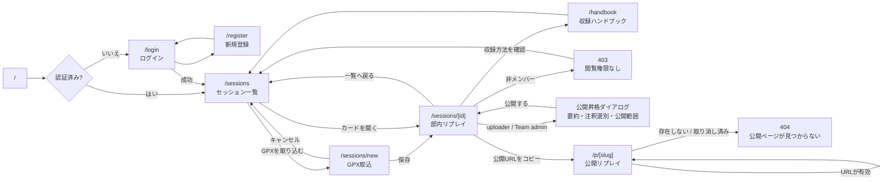
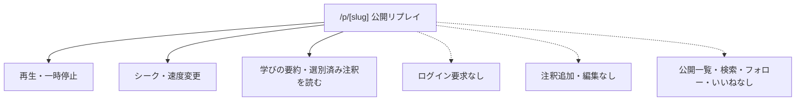

# sailvlog v3 — 画面遷移図

Phase 1で作る画面だけを対象にしています。凍結済みのArticle / Question / Learn / Feedは含みません。

```mermaid
flowchart LR
    Root["/"] --> Auth{"認証済み?"}
    Auth -->|いいえ| Login["/login<br>ログイン"]
    Login --> Register["/register<br>新規登録"]
    Register --> Login
    Auth -->|はい| Sessions["/sessions<br>セッション一覧"]
    Login -->|成功| Sessions

    Sessions -->|GPXを取り込む| Upload["/sessions/new<br>GPX取込"]
    Upload -->|保存| Replay["/sessions/[id]<br>部内リプレイ"]
    Upload -->|キャンセル| Sessions
    Sessions -->|カードを開く| Replay
    Replay -->|一覧へ戻る| Sessions
    Replay -->|収録方法を確認| Handbook["/handbook<br>収録ハンドブック"]
    Handbook --> Sessions

    Replay -->|非メンバー| Forbidden["403<br>閲覧権限なし"]
    Forbidden --> Sessions

    Replay -->|uploader / Team admin| Publish["公開昇格ダイアログ<br>要約・注釈選別・公開範囲"]
    Publish -->|公開する| Replay
    Replay -->|公開URLをコピー| Public["/p/[slug]<br>公開リプレイ"]
    Public -->|URLが有効| Public
    Public -->|存在しない / 取り消し済み| NotFound["404<br>公開ページが見つからない"]
```

## 公開ビューの境界

```mermaid
flowchart TD
    Public["/p/[slug] 公開リプレイ"] --> Play["再生・一時停止"]
    Public --> Seek["シーク・速度変更"]
    Public --> Read["学びの要約・選別済み注釈を読む"]
    Public -.-> NoAuth["ログイン要求なし"]
    Public -.-> NoWrite["注釈追加・編集なし"]
    Public -.-> NoExplore["公開一覧・検索・フォロー・いいねなし"]
```
